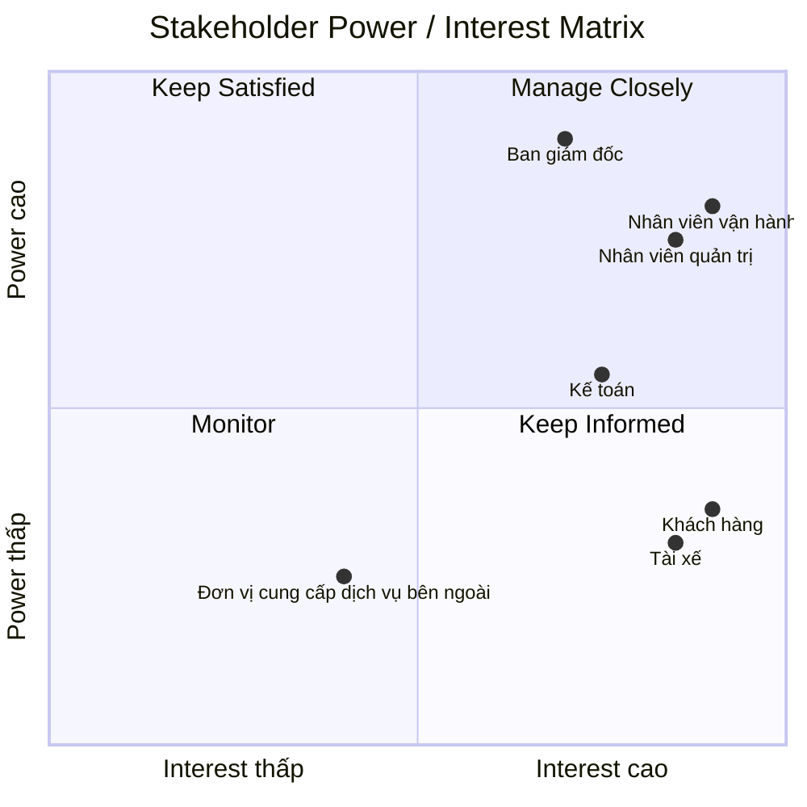

# 23655581_LeThaoUyen_capsystem
# 1.Vấn đề của doanh nghiệp:
- Công ty ABC cần xây dựng một nền tảng CAB System để tự động hóa quy trình đặt và quản lý chuyến xe
- Hệ thống hỗ trợ xuyên suốt từ tạo yêu cầu đặt xe → tìm và phân công tài xế → thực hiện chuyến → tính cước → thanh toán → đánh giá
- Hỗ trợ khách hàng theo dõi trạng thái chuyến đi và thông tin tài xế
- Hỗ trợ doanh nghiệp quản lý khách hàng, tài xế, phương tiện, chuyến đi và giao dịch tập trung
- Tự động hóa việc tìm kiếm và điều phối tài xế, bao gồm xử lý trường hợp tài xế từ chối hoặc không phản hồi
- Đảm bảo bảo mật thông tin người dùng, dữ liệu vị trí và dữ liệu giao dịch
- Hệ thống cần ổn định, có khả năng mở rộng khi số lượng khách hàng và tài xế tăng
- Có khả năng tích hợp thêm phương thức thanh toán, kênh thông báo và các dịch vụ mới trong tương lai
- Hỗ trợ doanh nghiệp theo dõi hoạt động và báo cáo để phục vụ công tác vận hành và quản lý

#   Mục tiêu của doanh nghiệp:
- Tự động hóa quy trình đặt xe và điều phối tài xế
- Nâng cao trải nghiệm khách hàng thông qua việc theo dõi chuyến đi và cập nhật trạng thái rõ ràng
- Giảm tải các công việc thủ công cho bộ phận vận hành
- Quản lý tập trung khách hàng, tài xế, phương tiện, chuyến đi và giao dịch
- Nâng cao hiệu quả sử dụng và phân công tài xế
- Đảm bảo hệ thống hoạt động ổn định khi số lượng khách hàng và tài xế tăng
- Bảo vệ thông tin cá nhân, dữ liệu vị trí và thông tin giao dịch
- Cung cấp dữ liệu và báo cáo để doanh nghiệp theo dõi hiệu quả hoạt động
- Tạo nền tảng linh hoạt để mở rộng thêm dịch vụ, phương thức thanh toán và kênh thông báo trong tương lai

# 2.Xác định stakeholder-vai trò (vẽ table):
| Stakeholder | Vai trò |
|---|---|
| Khách hàng | Đăng ký tài khoản, đặt xe, theo dõi chuyến đi, thanh toán và đánh giá tài xế |
| Tài xế | Quản lý hồ sơ, phương tiện, trạng thái hoạt động; nhận/từ chối chuyến và cập nhật trạng thái chuyến |
| Nhân viên vận hành | Quản lý khách hàng, tài xế, phương tiện và chuyến đi; theo dõi chuyến đang diễn ra và xử lý các trường hợp phát sinh |
| Nhân viên quản trị | Quản lý tài khoản, phân quyền và thực hiện các thao tác quản trị được cấp quyền |
| Kế toán | Tra cứu và đối soát các giao dịch, doanh thu và thông tin thanh toán của các chuyến đi |
| Ban giám đốc | Theo dõi số lượng chuyến, doanh thu, tỷ lệ hoàn thành, tỷ lệ hủy và hiệu quả hoạt động của tài xế |
| Đơn vị cung cấp dịch vụ bên ngoài | Cung cấp dịch vụ thanh toán điện tử và các kênh thông báo được tích hợp với hệ thống |

# 3.Vẽ matrix:

#  Mục đích nghiệp vụ của các bên liên quan:
| Stakeholder | Mục đích nghiệp vụ |
|---|---|
| Khách hàng | Đặt xe thuận tiện, theo dõi chuyến đi, biết thông tin tài xế, thanh toán và đánh giá chất lượng dịch vụ |
| Tài xế | Nhận các chuyến phù hợp, chủ động quản lý trạng thái hoạt động, thực hiện chuyến và cập nhật trạng thái |
| Nhân viên vận hành | Theo dõi và điều phối chuyến xe, quản lý tài xế, xử lý các trường hợp phát sinh và đảm bảo hoạt động đặt xe diễn ra ổn định |
| Nhân viên quản trị | Quản lý tài khoản, phân quyền người dùng và kiểm soát các thao tác quản trị trên hệ thống |
| Kế toán | Theo dõi, tra cứu và đối soát các giao dịch, doanh thu và thông tin thanh toán |
| Ban giám đốc | Theo dõi tình hình kinh doanh, doanh thu, số lượng chuyến và hiệu quả hoạt động để hỗ trợ việc ra quyết định |
| Đơn vị cung cấp dịch vụ bên ngoài | Đảm bảo cung cấp ổn định các dịch vụ thanh toán điện tử và thông báo được tích hợp với hệ thống |

# 4.Xác định phạm vi nhất định trong vòng 7 tuần: 
| STT | Phạm vi | Nội dung |
|---:|---|---|
| 1 | Quản lý tài khoản | Đăng ký, đăng nhập, cập nhật thông tin cá nhân |
| 2 | Đặt xe | Nhập điểm đón, điểm đến, chọn loại xe và gửi yêu cầu đặt xe |
| 3 | Tìm tài xế | Tìm và phân công tài xế phù hợp dựa trên vị trí và trạng thái |
| 4 | Quản lý chuyến đi | Theo dõi và cập nhật trạng thái chuyến |
| 5 | Quản lý tài xế | Quản lý hồ sơ, phương tiện và trạng thái hoạt động |
| 6 | Tính cước và thanh toán | Tính tiền chuyến đi và hỗ trợ thanh toán |
| 7 | Thông báo | Thông báo cho khách hàng và tài xế về trạng thái chuyến |
| 8 | Đánh giá | Khách hàng đánh giá tài xế sau khi hoàn thành chuyến |
| 9 | Quản trị | Nhân viên quản lý khách hàng, tài xế và chuyến đi |
| 10 | Báo cáo | Theo dõi số lượng chuyến, doanh thu và tình trạng hoạt động |

# 5.Chuyển thành yêu cầu doanh nghiệp: 
| ID | Yêu cầu doanh nghiệp | Mô tả |
|---|---|---|
| BR-01 | Tự động hóa quy trình đặt xe | Hệ thống hỗ trợ tự động hóa quy trình từ khi khách hàng tạo yêu cầu đến khi chuyến đi hoàn thành |
| BR-02 | Nâng cao trải nghiệm khách hàng | Hệ thống cho phép khách hàng đặt xe, theo dõi trạng thái chuyến và biết thông tin tài xế |
| BR-03 | Tự động hóa điều phối tài xế | Hệ thống tự động tìm kiếm và phân công tài xế phù hợp cho chuyến đi |
| BR-04 | Quản lý tập trung | Hệ thống hỗ trợ doanh nghiệp quản lý tập trung khách hàng, tài xế, phương tiện và chuyến đi |
| BR-05 | Hỗ trợ thanh toán | Hệ thống hỗ trợ tính cước và thanh toán cho các chuyến đi |
| BR-06 | Cung cấp thông báo | Hệ thống thông báo cho khách hàng và tài xế về các trạng thái quan trọng của chuyến đi |
| BR-07 | Hỗ trợ quản lý vận hành | Hệ thống giúp nhân viên vận hành theo dõi chuyến đi, tài xế và xử lý các trường hợp phát sinh |
| BR-08 | Cung cấp báo cáo | Hệ thống cung cấp thông tin về số lượng chuyến, doanh thu, tỷ lệ hoàn thành và tỷ lệ hủy |
| BR-09 | Đảm bảo bảo mật | Hệ thống bảo vệ thông tin cá nhân, dữ liệu vị trí và thông tin giao dịch của người dùng |
| BR-10 | Có khả năng mở rộng | Hệ thống có khả năng mở rộng để hỗ trợ thêm dịch vụ, phương thức thanh toán và kênh thông báo trong tương lai |

# 6.Functional Requirements
## Quản lý tài khoản
| ID | Chức năng | Mô tả |
|---|---|---|
| FR-01 | Đăng ký | Khách hàng và tài xế có thể đăng ký tài khoản |
| FR-02 | Đăng nhập | Người dùng có thể đăng nhập vào hệ thống |
| FR-03 | Cập nhật thông tin | Người dùng có thể xem và cập nhật thông tin cá nhân |
| FR-04 | Phân quyền | Hệ thống phân quyền theo vai trò của người dùng |

## Quản lý tài xế

| ID | Chức năng | Mô tả |
|---|---|---|
| FR-05 | Quản lý hồ sơ tài xế | Tài xế có thể cập nhật thông tin cá nhân |
| FR-06 | Quản lý phương tiện | Tài xế có thể cập nhật thông tin phương tiện |
| FR-07 | Trạng thái hoạt động | Tài xế có thể chuyển sang trạng thái sẵn sàng hoặc không sẵn sàng |
| FR-08 | Cập nhật vị trí | Hệ thống ghi nhận vị trí hiện tại của tài xế |

## Đặt xe
| ID | Chức năng | Mô tả |
|---|---|---|
| FR-09 | Nhập điểm đón | Khách hàng nhập địa điểm đón |
| FR-10 | Nhập điểm đến | Khách hàng nhập địa điểm cần đến |
| FR-11 | Chọn loại xe | Khách hàng lựa chọn loại xe phù hợp |
| FR-12 | Tạo yêu cầu đặt xe | Khách hàng gửi yêu cầu đặt xe |
| FR-13 | Theo dõi yêu cầu | Khách hàng có thể theo dõi trạng thái yêu cầu đặt xe |

## Tìm và phân công tài xế
| ID | Chức năng | Mô tả |
|---|---|---|
| FR-14 | Tìm tài xế | Hệ thống tìm tài xế dựa trên vị trí và trạng thái sẵn sàng |
| FR-15 | Ưu tiên tài xế | Hệ thống ưu tiên tài xế phù hợp và gần khách hàng |
| FR-16 | Gửi yêu cầu chuyến | Hệ thống gửi thông tin chuyến đến tài xế |
| FR-17 | Nhận chuyến | Tài xế có thể chấp nhận yêu cầu chuyến |
| FR-18 | Từ chối chuyến | Tài xế có thể từ chối yêu cầu chuyến |
| FR-19 | Tìm tài xế thay thế | Nếu tài xế từ chối hoặc không phản hồi, hệ thống tiếp tục tìm tài xế khác |
| FR-20 | Thông báo không tìm được tài xế | Hệ thống thông báo cho khách hàng khi không tìm được tài xế |

## Quản lý chuyến đi
| ID | Chức năng | Mô tả |
|---|---|---|
| FR-21 | Xác nhận chuyến | Hệ thống xác nhận tài xế đã nhận chuyến |
| FR-22 | Cập nhật trạng thái | Tài xế cập nhật trạng thái chuyến |
| FR-23 | Đã đến điểm đón | Tài xế cập nhật khi đã đến điểm đón |
| FR-24 | Đã đón khách | Tài xế cập nhật khi đã đón khách |
| FR-25 | Đang di chuyển | Tài xế cập nhật khi bắt đầu di chuyển |
| FR-26 | Hoàn thành chuyến | Tài xế cập nhật khi chuyến đi hoàn thành |
| FR-27 | Theo dõi chuyến | Khách hàng có thể theo dõi trạng thái chuyến đi |

## Tính cước và thanh toán
| ID | Chức năng | Mô tả |
|---|---|---|
| FR-28 | Tính cước | Hệ thống tính số tiền khách hàng phải trả |
| FR-29 | Thanh toán tiền mặt | Khách hàng có thể thanh toán bằng tiền mặt |
| FR-30 | Thanh toán điện tử | Khách hàng có thể thanh toán thông qua nhà cung cấp thanh toán |
| FR-31 | Xử lý thanh toán thất bại | Hệ thống thông báo khi thanh toán thất bại và cho phép xử lý lại |
| FR-32 | Tra cứu giao dịch | Người có quyền có thể xem thông tin giao dịch |

## Thông báo
| ID | Chức năng | Mô tả |
|---|---|---|
| FR-33 | Thông báo tạo yêu cầu | Thông báo khi yêu cầu đặt xe được tiếp nhận |
| FR-34 | Thông báo tài xế | Thông báo khi tài xế nhận chuyến |
| FR-35 | Thông báo đến điểm đón | Thông báo khi tài xế đến điểm đón |
| FR-36 | Thông báo hoàn thành | Thông báo khi chuyến đi hoàn thành |
| FR-37 | Thông báo thanh toán | Thông báo kết quả thanh toán |
| FR-38 | Thông báo chuyến mới | Tài xế nhận thông báo khi có chuyến mới |

## Lịch sử và đánh giá
| ID | Chức năng | Mô tả |
|---|---|---|
| FR-39 | Xem lịch sử chuyến | Khách hàng có thể xem các chuyến đã thực hiện |
| FR-40 | Xem chi tiết chuyến | Khách hàng có thể xem thông tin chi tiết của chuyến |
| FR-41 | Đánh giá tài xế | Khách hàng có thể đánh giá tài xế sau khi hoàn thành chuyến |

## Quản trị và vận hành
| ID | Chức năng | Mô tả |
|---|---|---|
| FR-42 | Quản lý khách hàng | Nhân viên vận hành có thể xem và quản lý khách hàng |
| FR-43 | Quản lý tài xế | Nhân viên vận hành có thể xem và quản lý tài xế |
| FR-44 | Quản lý phương tiện | Nhân viên vận hành có thể quản lý thông tin phương tiện |
| FR-45 | Theo dõi chuyến đang diễn ra | Nhân viên vận hành có thể theo dõi các chuyến đang thực hiện |
| FR-46 | Xử lý chuyến lỗi | Nhân viên vận hành có thể hỗ trợ xử lý các chuyến gặp sự cố |
| FR-47 | Quản lý tài khoản | Nhân viên quản trị có thể quản lý tài khoản người dùng |
| FR-48 | Phân quyền người dùng | Nhân viên quản trị có thể phân quyền theo vai trò |

## Báo cáo
| ID | Chức năng | Mô tả |
|---|---|---|
| FR-49 | Báo cáo số lượng chuyến | Hệ thống cung cấp số lượng chuyến theo thời gian |
| FR-50 | Báo cáo doanh thu | Hệ thống cung cấp thông tin doanh thu |
| FR-51 | Tỷ lệ hoàn thành | Hệ thống cung cấp tỷ lệ chuyến hoàn thành |
| FR-52 | Tỷ lệ hủy | Hệ thống cung cấp tỷ lệ chuyến bị hủy |
| FR-53 | Hiệu quả tài xế | Hệ thống cung cấp thông tin về hiệu quả hoạt động của tài xế |

## Audit và bảo mật
| ID | Chức năng | Mô tả |
|---|---|---|
| FR-54 | Xác thực người dùng | Hệ thống yêu cầu người dùng đăng nhập trước khi sử dụng chức năng yêu cầu tài khoản |
| FR-55 | Kiểm soát quyền truy cập | Hệ thống kiểm tra quyền trước khi thực hiện các chức năng quản trị |
| FR-56 | Ghi nhận thao tác | Hệ thống lưu lại các thao tác quan trọng để phục vụ kiểm tra và xử lý sự cố |

# 7.Vẽ usecase:
# 8.Đặc tả usecase:
# 9.Phân tích quy trình nghiệp vụ:
# 10.Phân tich quy tắc nghiệp vụ:
