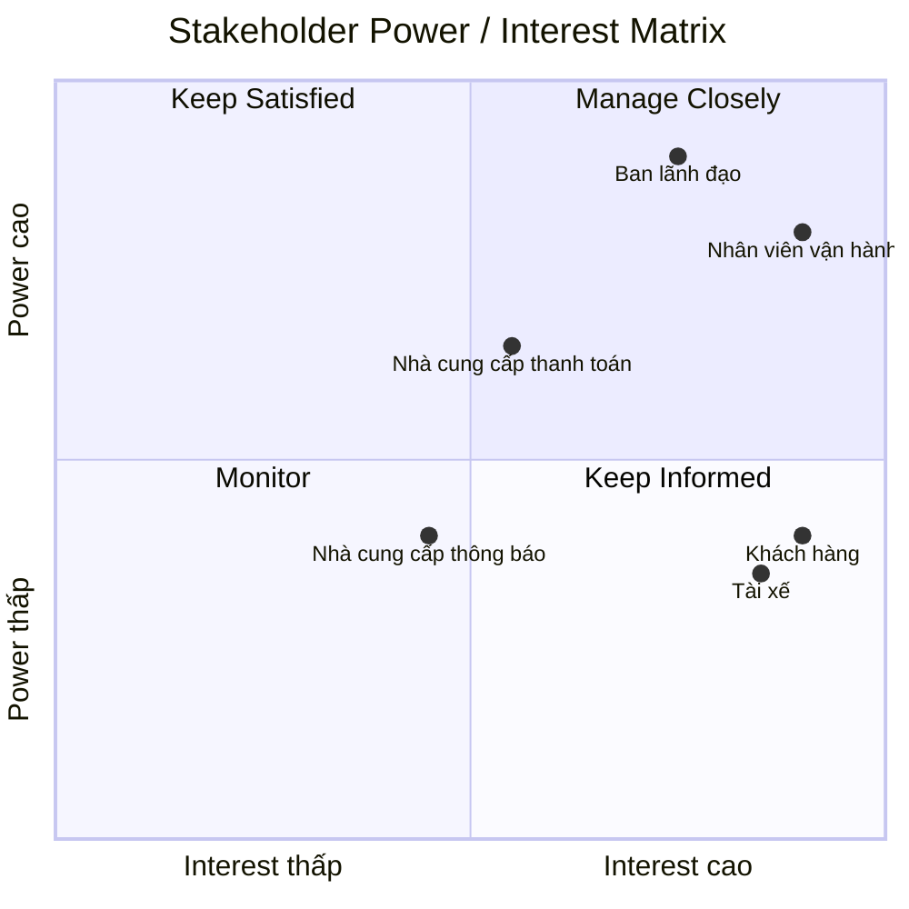
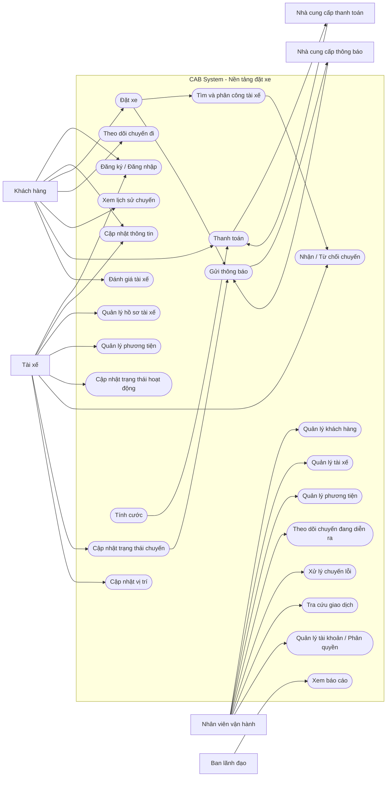

# 23655581_LeThaoUyen_cabsystem

## 1. Vấn đề và mục tiêu của doanh nghiệp
### 1.1. Vấn đề của doanh nghiệp
Hiện tại, Công ty ABC đang cung cấp dịch vụ đặt xe thông qua tổng đài và một ứng dụng đơn giản. Tuy nhiên, hệ thống hiện tại còn một số hạn chế:
- Việc phân công tài xế chủ yếu được thực hiện thủ công, gây khó khăn khi số lượng khách hàng và tài xế tăng.
- Khách hàng khó theo dõi trạng thái chuyến đi và thông tin về tài xế.
- Thông tin thanh toán chưa được quản lý tập trung.
- Bộ phận vận hành gặp khó khăn trong việc quản lý khách hàng, tài xế, phương tiện và chuyến đi.
- Hệ thống khó mở rộng khi doanh nghiệp muốn bổ sung các dịch vụ hoặc tính năng mới.
- Việc theo dõi và báo cáo tình hình hoạt động của hệ thống còn hạn chế.
### 1.2. Mục tiêu của doanh nghiệp
Doanh nghiệp mong muốn xây dựng **CAB System – Nền tảng đặt xe** nhằm:
- Tự động hóa quá trình tìm kiếm và phân công tài xế phù hợp.
- Hỗ trợ khách hàng đặt xe, theo dõi chuyến đi, thanh toán và đánh giá tài xế.
- Hỗ trợ tài xế nhận chuyến và cập nhật trạng thái trong quá trình thực hiện chuyến đi.
- Cung cấp giao diện quản trị để nhân viên vận hành quản lý khách hàng, tài xế, phương tiện và chuyến đi.
- Tích hợp thanh toán điện tử thông qua nhà cung cấp bên ngoài mà không lưu trực tiếp thông tin thanh toán nhạy cảm.
- Cung cấp hệ thống thông báo cho khách hàng và tài xế trong các trạng thái quan trọng của chuyến đi.
- Cung cấp dữ liệu và báo cáo để doanh nghiệp theo dõi hoạt động, doanh thu và hiệu quả vận hành.
- Xây dựng hệ thống có khả năng mở rộng, cho phép bổ sung dịch vụ, phương thức thanh toán và các kênh thông báo mới trong tương lai.

## 2.Xác định stakeholder-vai trò (vẽ table)
| Stakeholder | Vai trò | Mối quan tâm / Nhu cầu |
|---|---|---|
| **Khách hàng (Customer)** | Người sử dụng dịch vụ đặt xe | Đăng ký tài khoản, đặt xe, theo dõi chuyến đi, thanh toán, xem lịch sử và đánh giá tài xế |
| **Tài xế (Driver)** | Người tiếp nhận và thực hiện chuyến xe | Quản lý hồ sơ, phương tiện, nhận chuyến, cập nhật trạng thái và vị trí |
| **Nhân viên vận hành (Operator)** | Quản lý và hỗ trợ hoạt động của hệ thống | Quản lý khách hàng, tài xế, phương tiện, chuyến đi và xử lý các trường hợp phát sinh |
| **Ban lãnh đạo (Management)** | Theo dõi và đưa ra quyết định về hoạt động kinh doanh | Theo dõi số lượng chuyến, doanh thu, tỷ lệ hoàn thành, tỷ lệ hủy và hiệu quả hoạt động của tài xế |
| **Nhà cung cấp thanh toán (Payment Provider)** | Cung cấp dịch vụ thanh toán điện tử bên ngoài | Xử lý giao dịch thanh toán và trả kết quả giao dịch cho hệ thống |
| **Nhà cung cấp thông báo (Notification Provider)** | Cung cấp các kênh gửi thông báo | Gửi thông báo đến khách hàng và tài xế khi có sự kiện liên quan |

## 3.Vẽ matrix và mục đích nghiệp vụ của các bên liên quan
### 3.1.Vẽ matrix

### 3.2.Mục đích nghiệp vụ của các bên liên quan
| Stakeholder | Mục đích nghiệp vụ |
|---|---|
| **Khách hàng** | Đặt xe thuận tiện, theo dõi trạng thái chuyến đi, biết thông tin tài xế, thanh toán và đánh giá chất lượng dịch vụ. |
| **Tài xế** | Nhận các chuyến phù hợp, quản lý trạng thái hoạt động, thực hiện chuyến và cập nhật trạng thái chuyến đi. |
| **Nhân viên vận hành** | Theo dõi và điều phối chuyến xe, quản lý tài xế, khách hàng, phương tiện và xử lý các trường hợp phát sinh. |
| **Ban lãnh đạo** | Theo dõi số lượng chuyến, doanh thu, tỷ lệ hoàn thành, tỷ lệ hủy và hiệu quả hoạt động để hỗ trợ việc ra quyết định. |
| **Nhà cung cấp thanh toán** | Cung cấp dịch vụ thanh toán điện tử, xử lý giao dịch và trả kết quả thanh toán cho hệ thống CAB. |
| **Nhà cung cấp thông báo** | Cung cấp các kênh gửi thông báo đến khách hàng và tài xế khi có các sự kiện liên quan đến chuyến đi. |

## 4.Xác định phạm vi nhất định trong vòng 7 tuần
| STT | Phạm vi | Nội dung |
|---:|---|---|
| 1 | Quản lý tài khoản | Đăng ký, đăng nhập và cập nhật thông tin cá nhân của khách hàng, tài xế. |
| 2 | Đặt xe | Khách hàng nhập điểm đón, điểm đến, chọn loại xe và gửi yêu cầu đặt xe. |
| 3 | Tìm và phân công tài xế | Hệ thống tìm kiếm và phân công tài xế phù hợp dựa trên vị trí, trạng thái sẵn sàng và các tiêu chí vận hành. |
| 4 | Quản lý chuyến đi | Theo dõi và cập nhật trạng thái chuyến từ khi tài xế nhận chuyến đến khi hoàn thành. |
| 5 | Quản lý tài xế và phương tiện | Quản lý hồ sơ tài xế, thông tin phương tiện, trạng thái hoạt động và vị trí tài xế. |
| 6 | Tính cước và thanh toán | Tính số tiền khách hàng phải trả, hỗ trợ thanh toán tiền mặt và thanh toán điện tử thông qua nhà cung cấp bên ngoài. |
| 7 | Thông báo | Gửi thông báo cho khách hàng và tài xế về các trạng thái quan trọng của chuyến đi và kết quả thanh toán. |
| 8 | Lịch sử và đánh giá | Khách hàng xem lịch sử chuyến đi, số tiền phải trả và đánh giá tài xế sau khi hoàn thành chuyến. |
| 9 | Quản trị và vận hành | Nhân viên vận hành quản lý khách hàng, tài xế, phương tiện, chuyến đi và hỗ trợ xử lý các trường hợp phát sinh. |
| 10 | Báo cáo | Cung cấp báo cáo về số lượng chuyến, doanh thu, tỷ lệ hoàn thành, tỷ lệ hủy và hiệu quả hoạt động của tài xế. |

## 5.Chuyển thành yêu cầu doanh nghiệp
| ID | Yêu cầu doanh nghiệp | Mô tả |
|---|---|---|
| BR-01 | Tự động hóa quy trình đặt xe | Hệ thống hỗ trợ tự động hóa quy trình từ khi khách hàng tạo yêu cầu đặt xe đến khi chuyến đi hoàn thành. |
| BR-02 | Nâng cao trải nghiệm khách hàng | Hệ thống cho phép khách hàng đặt xe, theo dõi trạng thái chuyến đi, biết thông tin tài xế và xem lịch sử chuyến. |
| BR-03 | Tự động hóa điều phối tài xế | Hệ thống tự động tìm kiếm và phân công tài xế phù hợp dựa trên vị trí, trạng thái sẵn sàng và các tiêu chí vận hành. |
| BR-04 | Quản lý tập trung | Hệ thống hỗ trợ doanh nghiệp quản lý tập trung khách hàng, tài xế, phương tiện và chuyến đi. |
| BR-05 | Hỗ trợ thanh toán | Hệ thống hỗ trợ tính cước và thanh toán bằng tiền mặt hoặc phương thức thanh toán điện tử thông qua nhà cung cấp bên ngoài. |
| BR-06 | Cung cấp thông báo | Hệ thống gửi thông báo cho khách hàng và tài xế về các trạng thái quan trọng của chuyến đi và kết quả thanh toán. |
| BR-07 | Hỗ trợ quản lý vận hành | Hệ thống giúp nhân viên vận hành theo dõi chuyến đi, quản lý tài xế và xử lý các trường hợp phát sinh. |
| BR-08 | Cung cấp báo cáo | Hệ thống cung cấp thông tin về số lượng chuyến, doanh thu, tỷ lệ hoàn thành, tỷ lệ hủy và hiệu quả hoạt động của tài xế. |
| BR-09 | Đảm bảo bảo mật | Hệ thống bảo vệ thông tin cá nhân, thông tin phương tiện, dữ liệu vị trí và dữ liệu giao dịch của người dùng. |
| BR-10 | Có khả năng mở rộng | Hệ thống có khả năng mở rộng để hỗ trợ thêm dịch vụ, phương thức thanh toán, nhà cung cấp thông báo và các thành phần kỹ thuật mới trong tương lai. |

## 6.Functional Requirements
## 6.1. Quản lý tài khoản
| ID | Chức năng | Mô tả |
|---|---|---|
| FR-01 | Đăng ký tài khoản | Khách hàng có thể đăng ký tài khoản; tài xế có thể đăng ký hoặc được nhân viên vận hành tạo tài khoản. |
| FR-02 | Đăng nhập | Người dùng có tài khoản có thể đăng nhập vào hệ thống. |
| FR-03 | Cập nhật thông tin | Khách hàng và tài xế có thể xem, cập nhật thông tin cá nhân. |
| FR-04 | Phân quyền | Hệ thống phân quyền người dùng theo vai trò và kiểm soát các chức năng quản trị. |
## 6.2. Quản lý tài xế và phương tiện
| ID | Chức năng | Mô tả |
|---|---|---|
| FR-05 | Quản lý hồ sơ tài xế | Tài xế có thể cập nhật thông tin hồ sơ cá nhân. |
| FR-06 | Quản lý phương tiện | Tài xế có thể cập nhật thông tin phương tiện. |
| FR-07 | Trạng thái hoạt động | Tài xế có thể chuyển sang trạng thái sẵn sàng hoặc không sẵn sàng nhận chuyến. |
| FR-08 | Cập nhật vị trí | Hệ thống ghi nhận vị trí của tài xế để hỗ trợ tìm tài xế và dự kiến thời gian đến. |
## 6.3. Đặt xe
| ID | Chức năng | Mô tả |
|---|---|---|
| FR-09 | Nhập điểm đón | Khách hàng nhập địa điểm đón. |
| FR-10 | Nhập điểm đến | Khách hàng nhập địa điểm cần đến. |
| FR-11 | Chọn loại xe | Khách hàng lựa chọn loại xe phù hợp. |
| FR-12 | Tạo yêu cầu đặt xe | Khách hàng gửi yêu cầu đặt xe đến hệ thống. |
| FR-13 | Theo dõi yêu cầu | Khách hàng có thể theo dõi trạng thái yêu cầu đặt xe. |
## 6.4. Tìm và phân công tài xế
| ID | Chức năng | Mô tả |
|---|---|---|
| FR-14 | Tìm tài xế | Hệ thống tìm các tài xế phù hợp dựa trên vị trí và trạng thái sẵn sàng. |
| FR-15 | Ưu tiên tài xế | Hệ thống ưu tiên tài xế phù hợp và gần khách hàng theo các tiêu chí vận hành. |
| FR-16 | Gửi yêu cầu chuyến | Hệ thống gửi thông tin yêu cầu chuyến đến tài xế phù hợp. |
| FR-17 | Chấp nhận chuyến | Tài xế có thể chấp nhận yêu cầu chuyến. |
| FR-18 | Từ chối chuyến | Tài xế có thể từ chối yêu cầu chuyến. |
| FR-19 | Tìm tài xế thay thế | Nếu tài xế từ chối hoặc không phản hồi, hệ thống tiếp tục tìm tài xế khác. |
| FR-20 | Thông báo không tìm được tài xế | Hệ thống thông báo cho khách hàng khi không tìm được tài xế phù hợp. |
## 6.5. Quản lý chuyến đi
| ID | Chức năng | Mô tả |
|---|---|---|
| FR-21 | Xác nhận chuyến | Hệ thống xác nhận khi tài xế nhận chuyến. |
| FR-22 | Cập nhật trạng thái | Tài xế có thể cập nhật trạng thái của chuyến đi. |
| FR-23 | Đã đến điểm đón | Tài xế cập nhật trạng thái khi đã đến điểm đón. |
| FR-24 | Đã đón khách | Tài xế cập nhật trạng thái khi đã đón khách. |
| FR-25 | Đang di chuyển | Tài xế cập nhật trạng thái khi bắt đầu di chuyển. |
| FR-26 | Hoàn thành chuyến | Tài xế cập nhật trạng thái khi chuyến đi hoàn thành. |
| FR-27 | Theo dõi chuyến | Khách hàng có thể theo dõi trạng thái hiện tại của chuyến đi. |
## 6.6. Tính cước và thanh toán
| ID | Chức năng | Mô tả |
|---|---|---|
| FR-28 | Tính cước | Hệ thống xác định số tiền khách hàng phải trả dựa trên loại dịch vụ và thông tin chuyến đi. |
| FR-29 | Thanh toán tiền mặt | Khách hàng có thể thanh toán bằng tiền mặt. |
| FR-30 | Thanh toán điện tử | Khách hàng có thể thanh toán điện tử thông qua nhà cung cấp thanh toán bên ngoài. |
| FR-31 | Xử lý thanh toán thất bại | Hệ thống thông báo cho khách hàng khi thanh toán điện tử thất bại và cho phép xử lý lại theo chính sách của doanh nghiệp. |
| FR-32 | Tra cứu giao dịch | Nhân viên vận hành có quyền có thể tra cứu lịch sử và trạng thái giao dịch. |
## 6.7. Thông báo
| ID | Chức năng | Mô tả |
|---|---|---|
| FR-33 | Thông báo tiếp nhận yêu cầu | Hệ thống thông báo khi yêu cầu đặt xe được tiếp nhận. |
| FR-34 | Thông báo tài xế nhận chuyến | Hệ thống thông báo khi có tài xế nhận chuyến. |
| FR-35 | Thông báo tài xế đến điểm đón | Hệ thống thông báo khi tài xế đến điểm đón. |
| FR-36 | Thông báo hoàn thành chuyến | Hệ thống thông báo khi chuyến đi hoàn thành. |
| FR-37 | Thông báo kết quả thanh toán | Hệ thống thông báo cho khách hàng về kết quả thanh toán. |
| FR-38 | Thông báo chuyến mới | Tài xế nhận thông báo khi có yêu cầu chuyến mới hoặc thay đổi liên quan đến chuyến đang thực hiện. |
## 6.8. Lịch sử và đánh giá
| ID | Chức năng | Mô tả |
|---|---|---|
| FR-39 | Xem lịch sử chuyến | Khách hàng có thể xem lịch sử các chuyến đi đã thực hiện. |
| FR-40 | Xem chi tiết chuyến | Khách hàng có thể xem thông tin chi tiết và số tiền phải trả của chuyến đi. |
| FR-41 | Đánh giá tài xế | Khách hàng có thể đánh giá tài xế sau khi chuyến đi hoàn thành. |
## 6.9. Quản trị và vận hành
| ID | Chức năng | Mô tả |
|---|---|---|
| FR-42 | Quản lý khách hàng | Nhân viên vận hành có thể xem và quản lý thông tin khách hàng. |
| FR-43 | Quản lý tài xế | Nhân viên vận hành có thể xem và quản lý thông tin tài xế. |
| FR-44 | Quản lý phương tiện | Nhân viên vận hành có thể quản lý thông tin phương tiện. |
| FR-45 | Theo dõi chuyến đang diễn ra | Nhân viên vận hành có thể xem các chuyến đang thực hiện và trạng thái tài xế. |
| FR-46 | Xử lý chuyến lỗi | Nhân viên vận hành có thể hỗ trợ xử lý các trường hợp chuyến đi gặp sự cố. |
| FR-47 | Quản lý tài khoản | Nhân viên vận hành có quyền quản trị có thể quản lý tài khoản người dùng. |
| FR-48 | Phân quyền người dùng | Nhân viên vận hành có quyền quản trị có thể phân quyền cho các vai trò phù hợp. |
## 6.10. Báo cáo
| ID | Chức năng | Mô tả |
|---|---|---|
| FR-49 | Báo cáo số lượng chuyến | Hệ thống cung cấp báo cáo về số lượng chuyến. |
| FR-50 | Báo cáo doanh thu | Hệ thống cung cấp báo cáo về doanh thu. |
| FR-51 | Tỷ lệ hoàn thành | Hệ thống cung cấp tỷ lệ chuyến đi hoàn thành. |
| FR-52 | Tỷ lệ hủy | Hệ thống cung cấp tỷ lệ chuyến đi bị hủy. |
| FR-53 | Hiệu quả tài xế | Hệ thống cung cấp thông tin về hiệu quả hoạt động của tài xế. |
## 6.11. Xác thực và Audit
| ID | Chức năng | Mô tả |
|---|---|---|
| FR-54 | Xác thực người dùng | Hệ thống yêu cầu khách hàng và tài xế xác thực trước khi sử dụng các chức năng yêu cầu tài khoản. |
| FR-55 | Kiểm soát quyền truy cập | Hệ thống kiểm tra quyền trước khi người dùng thực hiện các chức năng quản trị. |
| FR-56 | Ghi nhận thao tác | Hệ thống lưu vết các thao tác quan trọng để phục vụ kiểm tra và xử lý sự cố. |

## 7.Vẽ usecase

# 8.Đặc tả usecase
# 8. Đặc tả Use Case

## UC1. Đăng ký / Đăng nhập

| Thành phần | Nội dung |
|---|---|
| Mã Use Case | UC1 |
| Tên Use Case | Đăng ký / Đăng nhập |
| Actor | Khách hàng, Tài xế |
| Mục tiêu | Cho phép người dùng đăng ký tài khoản và đăng nhập vào hệ thống. |
| Điều kiện trước | Người dùng chưa đăng nhập. |
| Điều kiện sau | Người dùng đăng nhập thành công và sử dụng chức năng theo vai trò. |

| Bước | Actor | System |
|---|---|---|
| 1 | Chọn chức năng đăng ký hoặc đăng nhập. | Hiển thị giao diện tương ứng. |
| 2 | Nhập thông tin tài khoản. | Kiểm tra dữ liệu đầu vào. |
| 3 | Gửi thông tin. | Xác thực hoặc tạo tài khoản. |
| 4 | — | Thông báo kết quả và chuyển vào hệ thống. |

| Ngoại lệ | Xử lý |
|---|---|
| Thông tin không hợp lệ | Thông báo lỗi và yêu cầu nhập lại. |
| Đăng nhập sai | Thông báo đăng nhập thất bại. |

---

## UC2. Cập nhật thông tin

| Thành phần | Nội dung |
|---|---|
| Mã Use Case | UC2 |
| Tên Use Case | Cập nhật thông tin |
| Actor | Khách hàng, Tài xế |
| Mục tiêu | Cập nhật thông tin cá nhân. |
| Điều kiện trước | Đã đăng nhập. |
| Điều kiện sau | Thông tin được cập nhật thành công. |

| Bước | Actor | System |
|---|---|---|
| 1 | Mở hồ sơ cá nhân. | Hiển thị thông tin hiện tại. |
| 2 | Chỉnh sửa thông tin. | Kiểm tra dữ liệu. |
| 3 | Nhấn lưu. | Cập nhật dữ liệu. |
| 4 | — | Thông báo thành công. |

| Ngoại lệ | Xử lý |
|---|---|
| Dữ liệu không hợp lệ | Thông báo lỗi. |

---

## UC3. Đặt xe

| Thành phần | Nội dung |
|---|---|
| Mã Use Case | UC3 |
| Tên Use Case | Đặt xe |
| Actor | Khách hàng |
| Mục tiêu | Tạo yêu cầu đặt xe. |
| Điều kiện trước | Khách hàng đã đăng nhập. |
| Điều kiện sau | Yêu cầu được tạo và chuyển sang tìm tài xế. |

| Bước | Actor | System |
|---|---|---|
| 1 | Chọn chức năng đặt xe. | Hiển thị biểu mẫu đặt xe. |
| 2 | Nhập điểm đón và điểm đến. | Kiểm tra thông tin địa điểm. |
| 3 | Chọn loại xe. | Hiển thị dịch vụ tương ứng. |
| 4 | Xác nhận đặt xe. | Tạo yêu cầu đặt xe. |
| 5 | — | Chuyển yêu cầu sang UC14. |
| 6 | Nhận thông tin tài xế. | Hiển thị trạng thái chuyến. |

| Ngoại lệ | Xử lý |
|---|---|
| Điểm đón hoặc điểm đến không hợp lệ | Yêu cầu nhập lại. |
| Không tìm được tài xế | Thông báo cho khách hàng. |

---

## UC4. Theo dõi chuyến đi

| Thành phần | Nội dung |
|---|---|
| Mã Use Case | UC4 |
| Tên Use Case | Theo dõi chuyến đi |
| Actor | Khách hàng |
| Mục tiêu | Theo dõi trạng thái và vị trí tài xế. |
| Điều kiện trước | Đã có chuyến đi. |
| Điều kiện sau | Hiển thị trạng thái mới nhất. |

| Bước | Actor | System |
|---|---|---|
| 1 | Mở thông tin chuyến. | Hiển thị thông tin chuyến. |
| 2 | Theo dõi trạng thái. | Cập nhật trạng thái liên tục. |
| 3 | Xem vị trí tài xế. | Hiển thị vị trí hiện tại. |

| Ngoại lệ | Xử lý |
|---|---|
| Chưa có tài xế | Hiển thị trạng thái đang tìm tài xế. |

---

## UC5. Xem lịch sử chuyến

| Thành phần | Nội dung |
|---|---|
| Mã Use Case | UC5 |
| Tên Use Case | Xem lịch sử chuyến |
| Actor | Khách hàng |
| Mục tiêu | Xem các chuyến đã thực hiện. |
| Điều kiện trước | Đã đăng nhập. |
| Điều kiện sau | Hiển thị lịch sử chuyến. |

| Bước | Actor | System |
|---|---|---|
| 1 | Chọn lịch sử chuyến. | Lấy danh sách chuyến. |
| 2 | Chọn một chuyến. | Hiển thị chi tiết chuyến. |

| Ngoại lệ | Xử lý |
|---|---|
| Chưa có lịch sử | Thông báo chưa có chuyến. |

---

## UC6. Thanh toán

| Thành phần | Nội dung |
|---|---|
| Mã Use Case | UC6 |
| Tên Use Case | Thanh toán |
| Actor | Khách hàng, Nhà cung cấp thanh toán |
| Mục tiêu | Thanh toán chi phí chuyến đi. |
| Điều kiện trước | Chuyến đã hoàn thành và có số tiền cần trả. |
| Điều kiện sau | Giao dịch được ghi nhận. |

| Bước | Actor | System |
|---|---|---|
| 1 | Chọn phương thức thanh toán. | Hiển thị số tiền phải trả. |
| 2 | Xác nhận thanh toán. | Tạo giao dịch. |
| 3 | Thực hiện thanh toán điện tử hoặc tiền mặt. | Gửi yêu cầu đến Payment Provider nếu cần. |
| 4 | — | Nhận kết quả giao dịch. |
| 5 | Xem kết quả. | Cập nhật trạng thái thanh toán. |

| Ngoại lệ | Xử lý |
|---|---|
| Thanh toán thất bại | Thông báo và cho phép xử lý lại. |

---

## UC7. Đánh giá tài xế

| Thành phần | Nội dung |
|---|---|
| Mã Use Case | UC7 |
| Tên Use Case | Đánh giá tài xế |
| Actor | Khách hàng |
| Mục tiêu | Đánh giá tài xế sau chuyến đi. |
| Điều kiện trước | Chuyến đã hoàn thành. |
| Điều kiện sau | Đánh giá được lưu. |

| Bước | Actor | System |
|---|---|---|
| 1 | Mở chuyến đã hoàn thành. | Hiển thị chức năng đánh giá. |
| 2 | Chọn mức đánh giá. | Kiểm tra dữ liệu. |
| 3 | Gửi đánh giá. | Lưu đánh giá. |

| Ngoại lệ | Xử lý |
|---|---|
| Đã đánh giá | Không cho phép đánh giá lại. |

---

## UC8. Quản lý hồ sơ tài xế

| Thành phần | Nội dung |
|---|---|
| Mã Use Case | UC8 |
| Tên Use Case | Quản lý hồ sơ tài xế |
| Actor | Tài xế |
| Mục tiêu | Cập nhật hồ sơ cá nhân. |
| Điều kiện trước | Đã đăng nhập. |
| Điều kiện sau | Hồ sơ được cập nhật. |

| Bước | Actor | System |
|---|---|---|
| 1 | Mở hồ sơ. | Hiển thị thông tin. |
| 2 | Chỉnh sửa hồ sơ. | Kiểm tra dữ liệu. |
| 3 | Lưu thông tin. | Cập nhật hồ sơ. |

| Ngoại lệ | Xử lý |
|---|---|
| Dữ liệu sai | Thông báo lỗi. |

---

## UC9. Quản lý phương tiện

| Thành phần | Nội dung |
|---|---|
| Mã Use Case | UC9 |
| Tên Use Case | Quản lý phương tiện |
| Actor | Tài xế |
| Mục tiêu | Quản lý thông tin phương tiện. |
| Điều kiện trước | Đã đăng nhập. |
| Điều kiện sau | Thông tin phương tiện được lưu. |

| Bước | Actor | System |
|---|---|---|
| 1 | Mở thông tin phương tiện. | Hiển thị dữ liệu hiện tại. |
| 2 | Chỉnh sửa thông tin. | Kiểm tra dữ liệu. |
| 3 | Lưu thay đổi. | Cập nhật phương tiện. |

| Ngoại lệ | Xử lý |
|---|---|
| Thông tin không hợp lệ | Thông báo lỗi. |

---

## UC10. Cập nhật trạng thái hoạt động

| Thành phần | Nội dung |
|---|---|
| Mã Use Case | UC10 |
| Tên Use Case | Cập nhật trạng thái hoạt động |
| Actor | Tài xế |
| Mục tiêu | Chuyển trạng thái sẵn sàng hoặc không sẵn sàng. |
| Điều kiện trước | Đã đăng nhập. |
| Điều kiện sau | Trạng thái hoạt động được cập nhật. |

| Bước | Actor | System |
|---|---|---|
| 1 | Chọn trạng thái hoạt động. | Hiển thị lựa chọn trạng thái. |
| 2 | Chọn sẵn sàng hoặc không sẵn sàng. | Cập nhật trạng thái. |
| 3 | — | Đưa vào danh sách nhận chuyến nếu sẵn sàng. |

---

## UC11. Nhận / Từ chối chuyến

| Thành phần | Nội dung |
|---|---|
| Mã Use Case | UC11 |
| Tên Use Case | Nhận / Từ chối chuyến |
| Actor | Tài xế |
| Mục tiêu | Phản hồi yêu cầu chuyến. |
| Điều kiện trước | Tài xế đang sẵn sàng. |
| Điều kiện sau | Chuyến được nhận hoặc tìm tài xế khác. |

| Bước | Actor | System |
|---|---|---|
| 1 | Nhận thông báo chuyến mới. | Gửi thông tin chuyến. |
| 2 | Xem chi tiết chuyến. | Hiển thị thông tin chuyến. |
| 3 | Chọn nhận chuyến. | Xác nhận tài xế. |
| 4 | — | Thông báo cho khách hàng. |

| Ngoại lệ | Xử lý |
|---|---|
| Từ chối chuyến | Tiếp tục tìm tài xế khác. |
| Không phản hồi | Tiếp tục tìm tài xế khác. |

---

## UC12. Cập nhật trạng thái chuyến

| Thành phần | Nội dung |
|---|---|
| Mã Use Case | UC12 |
| Tên Use Case | Cập nhật trạng thái chuyến |
| Actor | Tài xế |
| Mục tiêu | Cập nhật tiến trình chuyến. |
| Điều kiện trước | Đã nhận chuyến. |
| Điều kiện sau | Trạng thái chuyến được cập nhật. |

| Bước | Actor | System |
|---|---|---|
| 1 | Chọn đã đến điểm đón. | Lưu trạng thái. |
| 2 | Chọn đã đón khách. | Cập nhật chuyến. |
| 3 | Chọn đang di chuyển. | Cập nhật trạng thái. |
| 4 | Chọn hoàn thành chuyến. | Xác nhận hoàn thành và chuyển tính cước. |

---

## UC13. Cập nhật vị trí

| Thành phần | Nội dung |
|---|---|
| Mã Use Case | UC13 |
| Tên Use Case | Cập nhật vị trí |
| Actor | Tài xế |
| Mục tiêu | Cập nhật vị trí hiện tại. |
| Điều kiện trước | Tài xế đang hoạt động. |
| Điều kiện sau | Vị trí được lưu. |

| Bước | Actor | System |
|---|---|---|
| 1 | Di chuyển trong quá trình hoạt động. | Nhận dữ liệu vị trí. |
| 2 | — | Cập nhật vị trí tài xế. |
| 3 | — | Sử dụng vị trí để hỗ trợ tìm tài xế. |

---

## UC14. Tìm và phân công tài xế

| Thành phần | Nội dung |
|---|---|
| Mã Use Case | UC14 |
| Tên Use Case | Tìm và phân công tài xế |
| Actor | System |
| Mục tiêu | Tìm tài xế phù hợp cho yêu cầu đặt xe. |
| Điều kiện trước | Có yêu cầu đặt xe. |
| Điều kiện sau | Có tài xế hoặc thông báo không tìm được. |

| Bước | Actor | System |
|---|---|---|
| 1 | — | Nhận yêu cầu đặt xe. |
| 2 | — | Tìm tài xế đang sẵn sàng. |
| 3 | — | Lọc theo vị trí và tiêu chí vận hành. |
| 4 | — | Gửi yêu cầu đến tài xế phù hợp. |
| 5 | Tài xế chấp nhận. | Xác nhận phân công. |
| 6 | — | Thông báo cho khách hàng. |

| Ngoại lệ | Xử lý |
|---|---|
| Tài xế từ chối | Tìm tài xế tiếp theo. |
| Không còn tài xế | Thông báo khách hàng. |

---

## UC15. Tính cước

| Thành phần | Nội dung |
|---|---|
| Mã Use Case | UC15 |
| Tên Use Case | Tính cước |
| Actor | System |
| Mục tiêu | Xác định số tiền khách hàng phải trả. |
| Điều kiện trước | Chuyến đã hoàn thành. |
| Điều kiện sau | Lưu thông tin cước. |

| Bước | Actor | System |
|---|---|---|
| 1 | — | Nhận dữ liệu chuyến. |
| 2 | — | Xác định loại dịch vụ. |
| 3 | — | Tính số tiền phải trả. |
| 4 | — | Lưu thông tin cước. |
| 5 | — | Chuyển sang thanh toán. |

---

## UC16. Gửi thông báo

| Thành phần | Nội dung |
|---|---|
| Mã Use Case | UC16 |
| Tên Use Case | Gửi thông báo |
| Actor | Nhà cung cấp thông báo |
| Mục tiêu | Gửi thông báo đến khách hàng và tài xế. |
| Điều kiện trước | Có sự kiện cần thông báo. |
| Điều kiện sau | Thông báo được gửi. |

| Bước | Actor | System |
|---|---|---|
| 1 | — | Xác định sự kiện. |
| 2 | — | Tạo nội dung thông báo. |
| 3 | — | Gửi yêu cầu đến Notification Provider. |
| 4 | Gửi thông báo. | Nhận kết quả gửi. |
| 5 | — | Lưu trạng thái thông báo. |

| Ngoại lệ | Xử lý |
|---|---|
| Gửi thất bại | Ghi nhận trạng thái thất bại. |

---

## UC17. Quản lý khách hàng

| Thành phần | Nội dung |
|---|---|
| Mã Use Case | UC17 |
| Tên Use Case | Quản lý khách hàng |
| Actor | Nhân viên vận hành |
| Mục tiêu | Quản lý thông tin khách hàng. |
| Điều kiện trước | Có quyền truy cập. |
| Điều kiện sau | Dữ liệu được cập nhật hoặc tra cứu. |

| Bước | Actor | System |
|---|---|---|
| 1 | Mở danh sách khách hàng. | Hiển thị danh sách. |
| 2 | Tìm kiếm khách hàng. | Trả kết quả tìm kiếm. |
| 3 | Chọn khách hàng. | Hiển thị chi tiết. |
| 4 | Cập nhật theo quyền. | Lưu dữ liệu. |

---

## UC18. Quản lý tài xế

| Thành phần | Nội dung |
|---|---|
| Mã Use Case | UC18 |
| Tên Use Case | Quản lý tài xế |
| Actor | Nhân viên vận hành |
| Mục tiêu | Quản lý thông tin tài xế. |
| Điều kiện trước | Có quyền truy cập. |
| Điều kiện sau | Thông tin được cập nhật. |

| Bước | Actor | System |
|---|---|---|
| 1 | Mở danh sách tài xế. | Hiển thị danh sách. |
| 2 | Tìm kiếm tài xế. | Hiển thị kết quả. |
| 3 | Chọn tài xế. | Hiển thị thông tin chi tiết. |
| 4 | Cập nhật dữ liệu. | Lưu thay đổi. |

---

## UC19. Quản lý phương tiện

| Thành phần | Nội dung |
|---|---|
| Mã Use Case | UC19 |
| Tên Use Case | Quản lý phương tiện |
| Actor | Nhân viên vận hành |
| Mục tiêu | Quản lý phương tiện trong hệ thống. |
| Điều kiện trước | Có quyền truy cập. |
| Điều kiện sau | Dữ liệu được cập nhật. |

| Bước | Actor | System |
|---|---|---|
| 1 | Mở danh sách phương tiện. | Hiển thị danh sách. |
| 2 | Chọn phương tiện. | Hiển thị thông tin. |
| 3 | Chỉnh sửa dữ liệu. | Kiểm tra thông tin. |
| 4 | Lưu thay đổi. | Cập nhật dữ liệu. |

---

## UC20. Theo dõi chuyến đang diễn ra

| Thành phần | Nội dung |
|---|---|
| Mã Use Case | UC20 |
| Tên Use Case | Theo dõi chuyến đang diễn ra |
| Actor | Nhân viên vận hành |
| Mục tiêu | Theo dõi các chuyến đang thực hiện. |
| Điều kiện trước | Có quyền truy cập. |
| Điều kiện sau | Hiển thị trạng thái chuyến. |

| Bước | Actor | System |
|---|---|---|
| 1 | Mở danh sách chuyến. | Hiển thị các chuyến đang diễn ra. |
| 2 | Chọn một chuyến. | Hiển thị thông tin chi tiết. |
| 3 | Theo dõi trạng thái. | Cập nhật dữ liệu chuyến. |

---

## UC21. Xử lý chuyến lỗi

| Thành phần | Nội dung |
|---|---|
| Mã Use Case | UC21 |
| Tên Use Case | Xử lý chuyến lỗi |
| Actor | Nhân viên vận hành |
| Mục tiêu | Hỗ trợ xử lý các sự cố của chuyến đi. |
| Điều kiện trước | Có chuyến phát sinh lỗi. |
| Điều kiện sau | Sự cố được ghi nhận và xử lý. |

| Bước | Actor | System |
|---|---|---|
| 1 | Mở chuyến gặp lỗi. | Hiển thị thông tin chuyến. |
| 2 | Kiểm tra nguyên nhân. | Cung cấp lịch sử chuyến. |
| 3 | Thực hiện xử lý. | Kiểm tra quyền và cập nhật dữ liệu. |
| 4 | Xác nhận kết quả. | Lưu lịch sử xử lý. |

---

## UC22. Tra cứu giao dịch

| Thành phần | Nội dung |
|---|---|
| Mã Use Case | UC22 |
| Tên Use Case | Tra cứu giao dịch |
| Actor | Nhân viên vận hành |
| Mục tiêu | Tra cứu thông tin giao dịch. |
| Điều kiện trước | Có quyền truy cập. |
| Điều kiện sau | Hiển thị kết quả giao dịch. |

| Bước | Actor | System |
|---|---|---|
| 1 | Mở chức năng tra cứu. | Hiển thị giao diện tìm kiếm. |
| 2 | Nhập thông tin giao dịch. | Kiểm tra dữ liệu tìm kiếm. |
| 3 | Gửi yêu cầu. | Tìm kiếm giao dịch. |
| 4 | Xem kết quả. | Hiển thị thông tin giao dịch. |

---

## UC23. Quản lý tài khoản / Phân quyền

| Thành phần | Nội dung |
|---|---|
| Mã Use Case | UC23 |
| Tên Use Case | Quản lý tài khoản / Phân quyền |
| Actor | Nhân viên vận hành có quyền quản trị |
| Mục tiêu | Quản lý tài khoản và phân quyền người dùng. |
| Điều kiện trước | Có quyền quản trị. |
| Điều kiện sau | Quyền truy cập được cập nhật. |

| Bước | Actor | System |
|---|---|---|
| 1 | Mở quản lý tài khoản. | Hiển thị danh sách tài khoản. |
| 2 | Chọn tài khoản. | Hiển thị quyền hiện tại. |
| 3 | Thay đổi quyền hoặc trạng thái. | Kiểm tra quyền thực hiện. |
| 4 | Xác nhận thay đổi. | Lưu dữ liệu và ghi nhận thao tác. |

| Ngoại lệ | Xử lý |
|---|---|
| Không có quyền | Từ chối thao tác. |

---

## UC24. Xem báo cáo

| Thành phần | Nội dung |
|---|---|
| Mã Use Case | UC24 |
| Tên Use Case | Xem báo cáo |
| Actor | Ban lãnh đạo |
| Mục tiêu | Theo dõi tình hình hoạt động và doanh thu. |
| Điều kiện trước | Hệ thống có dữ liệu. |
| Điều kiện sau | Báo cáo được hiển thị. |

| Bước | Actor | System |
|---|---|---|
| 1 | Truy cập chức năng báo cáo. | Hiển thị màn hình báo cáo. |
| 2 | Chọn khoảng thời gian. | Tổng hợp dữ liệu. |
| 3 | Chọn loại báo cáo. | Hiển thị số lượng chuyến, doanh thu, tỷ lệ hoàn thành và tỷ lệ hủy. |
| 4 | Xem hiệu quả tài xế. | Hiển thị dữ liệu hiệu quả hoạt động. |

# 9.Phân tích quy trình nghiệp vụ
# 10.Phân tich quy tắc nghiệp vụ
