# 23655581_LeThaoUyen_cabsystem

## 1. Vấn đề và mục tiêu của doanh nghiệp
### 1.1. Vấn đề của doanh nghiệp
Hiện tại, Công ty ABC đang cung cấp dịch vụ đặt xe thông qua tổng đài và một ứng dụng đơn giản. Tuy nhiên, hệ thống hiện tại còn một số hạn chế:
- Việc phân công tài xế chủ yếu được thực hiện thủ công, gây khó khăn khi số lượng khách hàng và tài xế tăng.
- Khách hàng khó theo dõi trạng thái chuyến đi và thông tin về tài xế.
- Thông tin thanh toán chưa được quản lý tập trung.
- Bộ phận vận hành gặp khó khăn trong việc quản lý khách hàng, tài xế, phương tiện và chuyến đi.
- Hệ thống khó mở rộng khi doanh nghiệp muốn bổ sung các dịch vụ hoặc tính năng mới.
- Việc theo dõi và báo cáo tình hình hoạt động của hệ thống còn hạn chế.
### 1.2. Mục tiêu của doanh nghiệp
Doanh nghiệp mong muốn xây dựng **CAB System – Nền tảng đặt xe** nhằm:
- Tự động hóa quá trình tìm kiếm và phân công tài xế phù hợp.
- Hỗ trợ khách hàng đặt xe, theo dõi chuyến đi, thanh toán và đánh giá tài xế.
- Hỗ trợ tài xế nhận chuyến và cập nhật trạng thái trong quá trình thực hiện chuyến đi.
- Cung cấp giao diện quản trị để nhân viên vận hành quản lý khách hàng, tài xế, phương tiện và chuyến đi.
- Tích hợp thanh toán điện tử thông qua nhà cung cấp bên ngoài mà không lưu trực tiếp thông tin thanh toán nhạy cảm.
- Cung cấp hệ thống thông báo cho khách hàng và tài xế trong các trạng thái quan trọng của chuyến đi.
- Cung cấp dữ liệu và báo cáo để doanh nghiệp theo dõi hoạt động, doanh thu và hiệu quả vận hành.
- Xây dựng hệ thống có khả năng mở rộng, cho phép bổ sung dịch vụ, phương thức thanh toán và các kênh thông báo mới trong tương lai.

## 2.Xác định stakeholder-vai trò (vẽ table)
| Stakeholder | Vai trò | Mối quan tâm / Nhu cầu |
|---|---|---|
| **Khách hàng (Customer)** | Người sử dụng dịch vụ đặt xe | Đăng ký tài khoản, đặt xe, theo dõi chuyến đi, thanh toán, xem lịch sử và đánh giá tài xế |
| **Tài xế (Driver)** | Người tiếp nhận và thực hiện chuyến xe | Quản lý hồ sơ, phương tiện, nhận chuyến, cập nhật trạng thái và vị trí |
| **Nhân viên vận hành (Operator)** | Quản lý và hỗ trợ hoạt động của hệ thống | Quản lý khách hàng, tài xế, phương tiện, chuyến đi và xử lý các trường hợp phát sinh |
| **Ban lãnh đạo (Management)** | Theo dõi và đưa ra quyết định về hoạt động kinh doanh | Theo dõi số lượng chuyến, doanh thu, tỷ lệ hoàn thành, tỷ lệ hủy và hiệu quả hoạt động của tài xế |
| **Nhà cung cấp thanh toán (Payment Provider)** | Cung cấp dịch vụ thanh toán điện tử bên ngoài | Xử lý giao dịch thanh toán và trả kết quả giao dịch cho hệ thống |
| **Nhà cung cấp thông báo (Notification Provider)** | Cung cấp các kênh gửi thông báo | Gửi thông báo đến khách hàng và tài xế khi có sự kiện liên quan |

## 3.Vẽ matrix và mục đích nghiệp vụ của các bên liên quan
### 3.1.Vẽ matrix
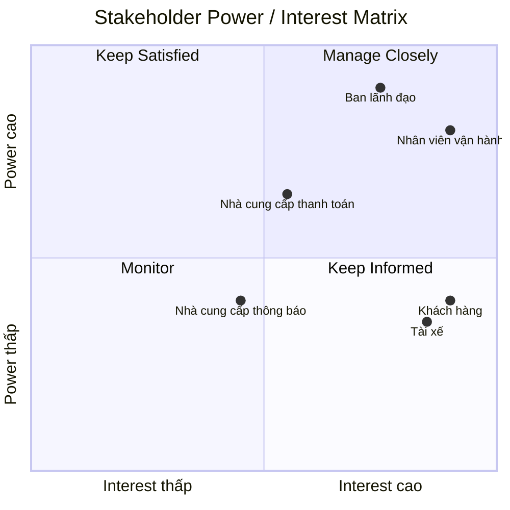
### 3.2.Mục đích nghiệp vụ của các bên liên quan
| Stakeholder | Mục đích nghiệp vụ |
|---|---|
| **Khách hàng** | Đặt xe thuận tiện, theo dõi trạng thái chuyến đi, biết thông tin tài xế, thanh toán và đánh giá chất lượng dịch vụ. |
| **Tài xế** | Nhận các chuyến phù hợp, quản lý trạng thái hoạt động, thực hiện chuyến và cập nhật trạng thái chuyến đi. |
| **Nhân viên vận hành** | Theo dõi và điều phối chuyến xe, quản lý tài xế, khách hàng, phương tiện và xử lý các trường hợp phát sinh. |
| **Ban lãnh đạo** | Theo dõi số lượng chuyến, doanh thu, tỷ lệ hoàn thành, tỷ lệ hủy và hiệu quả hoạt động để hỗ trợ việc ra quyết định. |
| **Nhà cung cấp thanh toán** | Cung cấp dịch vụ thanh toán điện tử, xử lý giao dịch và trả kết quả thanh toán cho hệ thống CAB. |
| **Nhà cung cấp thông báo** | Cung cấp các kênh gửi thông báo đến khách hàng và tài xế khi có các sự kiện liên quan đến chuyến đi. |

## 4.Xác định phạm vi nhất định trong vòng 7 tuần
| STT | Phạm vi | Nội dung |
|---:|---|---|
| 1 | Quản lý tài khoản | Đăng ký, đăng nhập và cập nhật thông tin cá nhân của khách hàng, tài xế. |
| 2 | Đặt xe | Khách hàng nhập điểm đón, điểm đến, chọn loại xe và gửi yêu cầu đặt xe. |
| 3 | Tìm và phân công tài xế | Hệ thống tìm kiếm và phân công tài xế phù hợp dựa trên vị trí, trạng thái sẵn sàng và các tiêu chí vận hành. |
| 4 | Quản lý chuyến đi | Theo dõi và cập nhật trạng thái chuyến từ khi tài xế nhận chuyến đến khi hoàn thành. |
| 5 | Quản lý tài xế và phương tiện | Quản lý hồ sơ tài xế, thông tin phương tiện, trạng thái hoạt động và vị trí tài xế. |
| 6 | Tính cước và thanh toán | Tính số tiền khách hàng phải trả, hỗ trợ thanh toán tiền mặt và thanh toán điện tử thông qua nhà cung cấp bên ngoài. |
| 7 | Thông báo | Gửi thông báo cho khách hàng và tài xế về các trạng thái quan trọng của chuyến đi và kết quả thanh toán. |
| 8 | Lịch sử và đánh giá | Khách hàng xem lịch sử chuyến đi, số tiền phải trả và đánh giá tài xế sau khi hoàn thành chuyến. |
| 9 | Quản trị và vận hành | Nhân viên vận hành quản lý khách hàng, tài xế, phương tiện, chuyến đi và hỗ trợ xử lý các trường hợp phát sinh. |
| 10 | Báo cáo | Cung cấp báo cáo về số lượng chuyến, doanh thu, tỷ lệ hoàn thành, tỷ lệ hủy và hiệu quả hoạt động của tài xế. |

## 5.Chuyển thành yêu cầu doanh nghiệp
| ID | Yêu cầu doanh nghiệp | Mô tả |
|---|---|---|
| BR-01 | Tự động hóa quy trình đặt xe | Hệ thống hỗ trợ tự động hóa quy trình từ khi khách hàng tạo yêu cầu đặt xe đến khi chuyến đi hoàn thành. |
| BR-02 | Nâng cao trải nghiệm khách hàng | Hệ thống cho phép khách hàng đặt xe, theo dõi trạng thái chuyến đi, biết thông tin tài xế và xem lịch sử chuyến. |
| BR-03 | Tự động hóa điều phối tài xế | Hệ thống tự động tìm kiếm và phân công tài xế phù hợp dựa trên vị trí, trạng thái sẵn sàng và các tiêu chí vận hành. |
| BR-04 | Quản lý tập trung | Hệ thống hỗ trợ doanh nghiệp quản lý tập trung khách hàng, tài xế, phương tiện và chuyến đi. |
| BR-05 | Hỗ trợ thanh toán | Hệ thống hỗ trợ tính cước và thanh toán bằng tiền mặt hoặc phương thức thanh toán điện tử thông qua nhà cung cấp bên ngoài. |
| BR-06 | Cung cấp thông báo | Hệ thống gửi thông báo cho khách hàng và tài xế về các trạng thái quan trọng của chuyến đi và kết quả thanh toán. |
| BR-07 | Hỗ trợ quản lý vận hành | Hệ thống giúp nhân viên vận hành theo dõi chuyến đi, quản lý tài xế và xử lý các trường hợp phát sinh. |
| BR-08 | Cung cấp báo cáo | Hệ thống cung cấp thông tin về số lượng chuyến, doanh thu, tỷ lệ hoàn thành, tỷ lệ hủy và hiệu quả hoạt động của tài xế. |
| BR-09 | Đảm bảo bảo mật | Hệ thống bảo vệ thông tin cá nhân, thông tin phương tiện, dữ liệu vị trí và dữ liệu giao dịch của người dùng. |
| BR-10 | Có khả năng mở rộng | Hệ thống có khả năng mở rộng để hỗ trợ thêm dịch vụ, phương thức thanh toán, nhà cung cấp thông báo và các thành phần kỹ thuật mới trong tương lai. |

## 6.Functional Requirements
## 6.1. Quản lý tài khoản
| ID | Chức năng | Mô tả |
|---|---|---|
| FR-01 | Đăng ký tài khoản | Khách hàng có thể đăng ký tài khoản; tài xế có thể đăng ký hoặc được nhân viên vận hành tạo tài khoản. |
| FR-02 | Đăng nhập | Người dùng có tài khoản có thể đăng nhập vào hệ thống. |
| FR-03 | Cập nhật thông tin | Khách hàng và tài xế có thể xem, cập nhật thông tin cá nhân. |
| FR-04 | Phân quyền | Hệ thống phân quyền người dùng theo vai trò và kiểm soát các chức năng quản trị. |
## 6.2. Quản lý tài xế và phương tiện
| ID | Chức năng | Mô tả |
|---|---|---|
| FR-05 | Quản lý hồ sơ tài xế | Tài xế có thể cập nhật thông tin hồ sơ cá nhân. |
| FR-06 | Quản lý phương tiện | Tài xế có thể cập nhật thông tin phương tiện. |
| FR-07 | Trạng thái hoạt động | Tài xế có thể chuyển sang trạng thái sẵn sàng hoặc không sẵn sàng nhận chuyến. |
| FR-08 | Cập nhật vị trí | Hệ thống ghi nhận vị trí của tài xế để hỗ trợ tìm tài xế và dự kiến thời gian đến. |
## 6.3. Đặt xe
| ID | Chức năng | Mô tả |
|---|---|---|
| FR-09 | Nhập điểm đón | Khách hàng nhập địa điểm đón. |
| FR-10 | Nhập điểm đến | Khách hàng nhập địa điểm cần đến. |
| FR-11 | Chọn loại xe | Khách hàng lựa chọn loại xe phù hợp. |
| FR-12 | Tạo yêu cầu đặt xe | Khách hàng gửi yêu cầu đặt xe đến hệ thống. |
| FR-13 | Theo dõi yêu cầu | Khách hàng có thể theo dõi trạng thái yêu cầu đặt xe. |
## 6.4. Tìm và phân công tài xế
| ID | Chức năng | Mô tả |
|---|---|---|
| FR-14 | Tìm tài xế | Hệ thống tìm các tài xế phù hợp dựa trên vị trí và trạng thái sẵn sàng. |
| FR-15 | Ưu tiên tài xế | Hệ thống ưu tiên tài xế phù hợp và gần khách hàng theo các tiêu chí vận hành. |
| FR-16 | Gửi yêu cầu chuyến | Hệ thống gửi thông tin yêu cầu chuyến đến tài xế phù hợp. |
| FR-17 | Chấp nhận chuyến | Tài xế có thể chấp nhận yêu cầu chuyến. |
| FR-18 | Từ chối chuyến | Tài xế có thể từ chối yêu cầu chuyến. |
| FR-19 | Tìm tài xế thay thế | Nếu tài xế từ chối hoặc không phản hồi, hệ thống tiếp tục tìm tài xế khác. |
| FR-20 | Thông báo không tìm được tài xế | Hệ thống thông báo cho khách hàng khi không tìm được tài xế phù hợp. |
## 6.5. Quản lý chuyến đi
| ID | Chức năng | Mô tả |
|---|---|---|
| FR-21 | Xác nhận chuyến | Hệ thống xác nhận khi tài xế nhận chuyến. |
| FR-22 | Cập nhật trạng thái | Tài xế có thể cập nhật trạng thái của chuyến đi. |
| FR-23 | Đã đến điểm đón | Tài xế cập nhật trạng thái khi đã đến điểm đón. |
| FR-24 | Đã đón khách | Tài xế cập nhật trạng thái khi đã đón khách. |
| FR-25 | Đang di chuyển | Tài xế cập nhật trạng thái khi bắt đầu di chuyển. |
| FR-26 | Hoàn thành chuyến | Tài xế cập nhật trạng thái khi chuyến đi hoàn thành. |
| FR-27 | Theo dõi chuyến | Khách hàng có thể theo dõi trạng thái hiện tại của chuyến đi. |
## 6.6. Tính cước và thanh toán
| ID | Chức năng | Mô tả |
|---|---|---|
| FR-28 | Tính cước | Hệ thống xác định số tiền khách hàng phải trả dựa trên loại dịch vụ và thông tin chuyến đi. |
| FR-29 | Thanh toán tiền mặt | Khách hàng có thể thanh toán bằng tiền mặt. |
| FR-30 | Thanh toán điện tử | Khách hàng có thể thanh toán điện tử thông qua nhà cung cấp thanh toán bên ngoài. |
| FR-31 | Xử lý thanh toán thất bại | Hệ thống thông báo cho khách hàng khi thanh toán điện tử thất bại và cho phép xử lý lại theo chính sách của doanh nghiệp. |
| FR-32 | Tra cứu giao dịch | Nhân viên vận hành có quyền có thể tra cứu lịch sử và trạng thái giao dịch. |
## 6.7. Thông báo
| ID | Chức năng | Mô tả |
|---|---|---|
| FR-33 | Thông báo tiếp nhận yêu cầu | Hệ thống thông báo khi yêu cầu đặt xe được tiếp nhận. |
| FR-34 | Thông báo tài xế nhận chuyến | Hệ thống thông báo khi có tài xế nhận chuyến. |
| FR-35 | Thông báo tài xế đến điểm đón | Hệ thống thông báo khi tài xế đến điểm đón. |
| FR-36 | Thông báo hoàn thành chuyến | Hệ thống thông báo khi chuyến đi hoàn thành. |
| FR-37 | Thông báo kết quả thanh toán | Hệ thống thông báo cho khách hàng về kết quả thanh toán. |
| FR-38 | Thông báo chuyến mới | Tài xế nhận thông báo khi có yêu cầu chuyến mới hoặc thay đổi liên quan đến chuyến đang thực hiện. |
## 6.8. Lịch sử và đánh giá
| ID | Chức năng | Mô tả |
|---|---|---|
| FR-39 | Xem lịch sử chuyến | Khách hàng có thể xem lịch sử các chuyến đi đã thực hiện. |
| FR-40 | Xem chi tiết chuyến | Khách hàng có thể xem thông tin chi tiết và số tiền phải trả của chuyến đi. |
| FR-41 | Đánh giá tài xế | Khách hàng có thể đánh giá tài xế sau khi chuyến đi hoàn thành. |
## 6.9. Quản trị và vận hành
| ID | Chức năng | Mô tả |
|---|---|---|
| FR-42 | Quản lý khách hàng | Nhân viên vận hành có thể xem và quản lý thông tin khách hàng. |
| FR-43 | Quản lý tài xế | Nhân viên vận hành có thể xem và quản lý thông tin tài xế. |
| FR-44 | Quản lý phương tiện | Nhân viên vận hành có thể quản lý thông tin phương tiện. |
| FR-45 | Theo dõi chuyến đang diễn ra | Nhân viên vận hành có thể xem các chuyến đang thực hiện và trạng thái tài xế. |
| FR-46 | Xử lý chuyến lỗi | Nhân viên vận hành có thể hỗ trợ xử lý các trường hợp chuyến đi gặp sự cố. |
| FR-47 | Quản lý tài khoản | Nhân viên vận hành có quyền quản trị có thể quản lý tài khoản người dùng. |
| FR-48 | Phân quyền người dùng | Nhân viên vận hành có quyền quản trị có thể phân quyền cho các vai trò phù hợp. |
## 6.10. Báo cáo
| ID | Chức năng | Mô tả |
|---|---|---|
| FR-49 | Báo cáo số lượng chuyến | Hệ thống cung cấp báo cáo về số lượng chuyến. |
| FR-50 | Báo cáo doanh thu | Hệ thống cung cấp báo cáo về doanh thu. |
| FR-51 | Tỷ lệ hoàn thành | Hệ thống cung cấp tỷ lệ chuyến đi hoàn thành. |
| FR-52 | Tỷ lệ hủy | Hệ thống cung cấp tỷ lệ chuyến đi bị hủy. |
| FR-53 | Hiệu quả tài xế | Hệ thống cung cấp thông tin về hiệu quả hoạt động của tài xế. |
## 6.11. Xác thực và Audit
| ID | Chức năng | Mô tả |
|---|---|---|
| FR-54 | Xác thực người dùng | Hệ thống yêu cầu khách hàng và tài xế xác thực trước khi sử dụng các chức năng yêu cầu tài khoản. |
| FR-55 | Kiểm soát quyền truy cập | Hệ thống kiểm tra quyền trước khi người dùng thực hiện các chức năng quản trị. |
| FR-56 | Ghi nhận thao tác | Hệ thống lưu vết các thao tác quan trọng để phục vụ kiểm tra và xử lý sự cố. |

## 7.Vẽ usecase

# 8.Đặc tả usecase
## UC1 - Đăng ký / Đăng nhập

<table>
<tr>
<td>- <b>Tên use case:</b></td>
<td>Đăng ký / Đăng nhập</td>
</tr>
<tr>
<td>- <b>Mô tả sơ lược:</b></td>
<td>Cho phép khách hàng và tài xế đăng ký tài khoản hoặc đăng nhập vào hệ thống để sử dụng các chức năng yêu cầu tài khoản.</td>
</tr>
<tr>
<td>- <b>Actor chính:</b></td>
<td>Khách hàng / Tài xế</td>
</tr>
<tr>
<td>- <b>Actor phụ:</b></td>
<td>Không có</td>
</tr>
<tr>
<td>- <b>Tiền điều kiện (Pre-condition):</b></td>
<td>Người dùng chưa đăng nhập hoặc chưa có tài khoản.</td>
</tr>
<tr>
<td>- <b>Hậu điều kiện (Post-condition):</b></td>
<td>Tài khoản được tạo thành công hoặc người dùng đăng nhập thành công vào hệ thống.</td>
</tr>
<tr>
<td colspan="2"><b>- Luồng sự kiện chính (main flow):</b></td>
</tr>
<tr>
<td><b>- Actor</b></td>
<td><b>- System</b></td>
</tr>
<tr>
<td>1. Chọn chức năng đăng ký hoặc đăng nhập.</td>
<td>2. Hiển thị form đăng ký / đăng nhập.</td>
</tr>
<tr>
<td>3. Nhập thông tin tài khoản.</td>
<td>4. Kiểm tra thông tin tài khoản.</td>
</tr>
<tr>
<td></td>
<td>5. Tạo tài khoản hoặc xác thực thông tin đăng nhập.</td>
</tr>
<tr>
<td></td>
<td>6. Thông báo kết quả và cho phép truy cập hệ thống.</td>
</tr>
<tr>
<td colspan="2"><b>- Luồng sự kiện thay thế (alternate flow):</b></td>
</tr>
<tr>
<td>3a. Người dùng đã có tài khoản và chọn đăng nhập.</td>
<td>Hệ thống chuyển sang bước xác thực thông tin đăng nhập.</td>
</tr>
<tr>
<td colspan="2"><b>- Luồng sự kiện ngoại lệ (exception flow):</b></td>
</tr>
<tr>
<td>3b. Thông tin đăng nhập không chính xác.</td>
<td>Hệ thống thông báo thông tin không hợp lệ và yêu cầu nhập lại.</td>
</tr>
</table>

---

## UC2 - Cập nhật thông tin

<table>
<tr>
<td>- <b>Tên use case:</b></td>
<td>Cập nhật thông tin</td>
</tr>
<tr>
<td>- <b>Mô tả sơ lược:</b></td>
<td>Cho phép khách hàng và tài xế xem và cập nhật thông tin cá nhân.</td>
</tr>
<tr>
<td>- <b>Actor chính:</b></td>
<td>Khách hàng / Tài xế</td>
</tr>
<tr>
<td>- <b>Actor phụ:</b></td>
<td>Không có</td>
</tr>
<tr>
<td>- <b>Tiền điều kiện:</b></td>
<td>Người dùng đã đăng nhập vào hệ thống.</td>
</tr>
<tr>
<td>- <b>Hậu điều kiện:</b></td>
<td>Thông tin cá nhân được cập nhật thành công.</td>
</tr>
<tr>
<td colspan="2"><b>- Luồng sự kiện chính (main flow):</b></td>
</tr>
<tr>
<td><b>- Actor</b></td>
<td><b>- System</b></td>
</tr>
<tr>
<td>1. Chọn chức năng cập nhật thông tin.</td>
<td>2. Hiển thị thông tin hiện tại.</td>
</tr>
<tr>
<td>3. Chỉnh sửa thông tin cá nhân.</td>
<td>4. Kiểm tra thông tin.</td>
</tr>
<tr>
<td></td>
<td>5. Lưu thông tin mới.</td>
</tr>
<tr>
<td></td>
<td>6. Thông báo cập nhật thành công.</td>
</tr>
<tr>
<td colspan="2"><b>- Luồng sự kiện thay thế (alternate flow):</b></td>
</tr>
<tr>
<td>3a. Người dùng không thay đổi thông tin.</td>
<td>Hệ thống giữ nguyên thông tin hiện tại.</td>
</tr>
<tr>
<td colspan="2"><b>- Luồng sự kiện ngoại lệ (exception flow):</b></td>
</tr>
<tr>
<td>3b. Thông tin nhập không hợp lệ.</td>
<td>Hệ thống thông báo lỗi và yêu cầu người dùng nhập lại.</td>
</tr>
</table>

---

## UC3 - Đặt xe

<table>
<tr>
<td>- <b>Tên use case:</b></td>
<td>Đặt xe</td>
</tr>
<tr>
<td>- <b>Mô tả sơ lược:</b></td>
<td>Cho phép khách hàng nhập điểm đón, điểm đến, chọn loại xe và gửi yêu cầu đặt xe.</td>
</tr>
<tr>
<td>- <b>Actor chính:</b></td>
<td>Khách hàng</td>
</tr>
<tr>
<td>- <b>Actor phụ:</b></td>
<td>Hệ thống tìm và phân công tài xế</td>
</tr>
<tr>
<td>- <b>Tiền điều kiện:</b></td>
<td>Khách hàng đã đăng nhập vào hệ thống.</td>
</tr>
<tr>
<td>- <b>Hậu điều kiện:</b></td>
<td>Yêu cầu đặt xe được tạo và hệ thống bắt đầu tìm tài xế.</td>
</tr>
<tr>
<td colspan="2"><b>- Luồng sự kiện chính (main flow):</b></td>
</tr>
<tr>
<td><b>- Actor</b></td>
<td><b>- System</b></td>
</tr>
<tr>
<td>1. Chọn chức năng đặt xe.</td>
<td>2. Hiển thị form đặt xe.</td>
</tr>
<tr>
<td>3. Nhập điểm đón và điểm đến.</td>
<td>4. Kiểm tra thông tin chuyến đi.</td>
</tr>
<tr>
<td>5. Chọn loại xe.</td>
<td>6. Ghi nhận yêu cầu đặt xe.</td>
</tr>
<tr>
<td></td>
<td>7. Thông báo yêu cầu đã được tiếp nhận.</td>
</tr>
<tr>
<td></td>
<td>8. Chuyển yêu cầu sang chức năng tìm và phân công tài xế.</td>
</tr>
<tr>
<td colspan="2"><b>- Luồng sự kiện thay thế (alternate flow):</b></td>
</tr>
<tr>
<td>5a. Khách hàng thay đổi loại xe.</td>
<td>Hệ thống cập nhật lại thông tin yêu cầu.</td>
</tr>
<tr>
<td colspan="2"><b>- Luồng sự kiện ngoại lệ (exception flow):</b></td>
</tr>
<tr>
<td>3a. Thiếu điểm đón hoặc điểm đến.</td>
<td>Hệ thống thông báo thông tin chưa đầy đủ và yêu cầu nhập lại.</td>
</tr>
</table>

---

## UC4 - Theo dõi chuyến đi

<table>
<tr>
<td>- <b>Tên use case:</b></td>
<td>Theo dõi chuyến đi</td>
</tr>
<tr>
<td>- <b>Mô tả sơ lược:</b></td>
<td>Cho phép khách hàng theo dõi trạng thái hiện tại của chuyến đi và thông tin tài xế.</td>
</tr>
<tr>
<td>- <b>Actor chính:</b></td>
<td>Khách hàng</td>
</tr>
<tr>
<td>- <b>Actor phụ:</b></td>
<td>Hệ thống</td>
</tr>
<tr>
<td>- <b>Tiền điều kiện:</b></td>
<td>Khách hàng đã có chuyến đi đang được xử lý hoặc đang thực hiện.</td>
</tr>
<tr>
<td>- <b>Hậu điều kiện:</b></td>
<td>Khách hàng xem được trạng thái mới nhất của chuyến đi.</td>
</tr>
<tr>
<td colspan="2"><b>- Luồng sự kiện chính (main flow):</b></td>
</tr>
<tr>
<td><b>- Actor</b></td>
<td><b>- System</b></td>
</tr>
<tr>
<td>1. Chọn chuyến đi cần theo dõi.</td>
<td>2. Hiển thị thông tin chuyến đi.</td>
</tr>
<tr>
<td></td>
<td>3. Hiển thị trạng thái chuyến và thông tin tài xế.</td>
</tr>
<tr>
<td></td>
<td>4. Cập nhật trạng thái khi có thay đổi.</td>
</tr>
<tr>
<td colspan="2"><b>- Luồng sự kiện thay thế:</b></td>
</tr>
<tr>
<td>1a. Khách hàng chưa có chuyến đang thực hiện.</td>
<td>Hệ thống thông báo không có chuyến đang hoạt động.</td>
</tr>
<tr>
<td colspan="2"><b>- Luồng sự kiện ngoại lệ:</b></td>
</tr>
<tr>
<td>3a. Không lấy được trạng thái mới.</td>
<td>Hệ thống thông báo không thể cập nhật trạng thái và yêu cầu thử lại.</td>
</tr>
</table>

---

## UC5 - Xem lịch sử chuyến

<table>
<tr>
<td>- <b>Tên use case:</b></td>
<td>Xem lịch sử chuyến</td>
</tr>
<tr>
<td>- <b>Mô tả sơ lược:</b></td>
<td>Cho phép khách hàng xem các chuyến đã thực hiện và thông tin chi tiết của từng chuyến.</td>
</tr>
<tr>
<td>- <b>Actor chính:</b></td>
<td>Khách hàng</td>
</tr>
<tr>
<td>- <b>Actor phụ:</b></td>
<td>Không có</td>
</tr>
<tr>
<td>- <b>Tiền điều kiện:</b></td>
<td>Khách hàng đã đăng nhập.</td>
</tr>
<tr>
<td>- <b>Hậu điều kiện:</b></td>
<td>Lịch sử chuyến được hiển thị.</td>
</tr>
<tr>
<td colspan="2"><b>- Luồng sự kiện chính (main flow):</b></td>
</tr>
<tr>
<td><b>- Actor</b></td>
<td><b>- System</b></td>
</tr>
<tr>
<td>1. Chọn chức năng lịch sử chuyến.</td>
<td>2. Truy xuất lịch sử chuyến của khách hàng.</td>
</tr>
<tr>
<td></td>
<td>3. Hiển thị danh sách các chuyến.</td>
</tr>
<tr>
<td>4. Chọn một chuyến cần xem.</td>
<td>5. Hiển thị thông tin chi tiết và số tiền phải trả.</td>
</tr>
<tr>
<td colspan="2"><b>- Luồng sự kiện thay thế:</b></td>
</tr>
<tr>
<td>1a. Không có lịch sử chuyến.</td>
<td>Hệ thống hiển thị thông báo chưa có chuyến đi.</td>
</tr>
<tr>
<td colspan="2"><b>- Luồng sự kiện ngoại lệ:</b></td>
</tr>
<tr>
<td>2a. Không truy xuất được dữ liệu.</td>
<td>Hệ thống thông báo lỗi và yêu cầu thử lại.</td>
</tr>
</table>

---

## UC6 - Thanh toán

<table>
<tr>
<td>- <b>Tên use case:</b></td>
<td>Thanh toán</td>
</tr>
<tr>
<td>- <b>Mô tả sơ lược:</b></td>
<td>Cho phép khách hàng thanh toán tiền mặt hoặc thanh toán điện tử sau khi chuyến đi hoàn thành.</td>
</tr>
<tr>
<td>- <b>Actor chính:</b></td>
<td>Khách hàng</td>
</tr>
<tr>
<td>- <b>Actor phụ:</b></td>
<td>Nhà cung cấp thanh toán</td>
</tr>
<tr>
<td>- <b>Tiền điều kiện:</b></td>
<td>Chuyến đi đã hoàn thành và hệ thống đã xác định số tiền phải thanh toán.</td>
</tr>
<tr>
<td>- <b>Hậu điều kiện:</b></td>
<td>Giao dịch được ghi nhận với trạng thái thành công hoặc thất bại.</td>
</tr>
<tr>
<td colspan="2"><b>- Luồng sự kiện chính (main flow):</b></td>
</tr>
<tr>
<td><b>- Actor</b></td>
<td><b>- System</b></td>
</tr>
<tr>
<td>1. Chọn phương thức thanh toán.</td>
<td>2. Hiển thị số tiền cần thanh toán.</td>
</tr>
<tr>
<td>3. Xác nhận thanh toán.</td>
<td>4. Xử lý thanh toán theo phương thức đã chọn.</td>
</tr>
<tr>
<td></td>
<td>5. Ghi nhận kết quả giao dịch.</td>
</tr>
<tr>
<td></td>
<td>6. Thông báo kết quả thanh toán.</td>
</tr>
<tr>
<td colspan="2"><b>- Luồng sự kiện thay thế:</b></td>
</tr>
<tr>
<td>1a. Chọn thanh toán tiền mặt.</td>
<td>Hệ thống ghi nhận phương thức thanh toán tiền mặt.</td>
</tr>
<tr>
<td>1b. Chọn thanh toán điện tử.</td>
<td>Hệ thống chuyển yêu cầu đến nhà cung cấp thanh toán.</td>
</tr>
<tr>
<td colspan="2"><b>- Luồng sự kiện ngoại lệ:</b></td>
</tr>
<tr>
<td>3a. Thanh toán điện tử thất bại.</td>
<td>Hệ thống thông báo thanh toán thất bại và cho phép xử lý lại theo chính sách.</td>
</tr>
</table>

---

## UC7 - Đánh giá tài xế

<table>
<tr>
<td>- <b>Tên use case:</b></td>
<td>Đánh giá tài xế</td>
</tr>
<tr>
<td>- <b>Mô tả sơ lược:</b></td>
<td>Cho phép khách hàng đánh giá tài xế sau khi chuyến đi hoàn thành.</td>
</tr>
<tr>
<td>- <b>Actor chính:</b></td>
<td>Khách hàng</td>
</tr>
<tr>
<td>- <b>Actor phụ:</b></td>
<td>Tài xế</td>
</tr>
<tr>
<td>- <b>Tiền điều kiện:</b></td>
<td>Chuyến đi đã hoàn thành.</td>
</tr>
<tr>
<td>- <b>Hậu điều kiện:</b></td>
<td>Đánh giá của khách hàng được lưu vào hệ thống.</td>
</tr>
<tr>
<td colspan="2"><b>- Luồng sự kiện chính (main flow):</b></td>
</tr>
<tr>
<td><b>- Actor</b></td>
<td><b>- System</b></td>
</tr>
<tr>
<td>1. Chọn chức năng đánh giá.</td>
<td>2. Hiển thị form đánh giá tài xế.</td>
</tr>
<tr>
<td>3. Nhập mức đánh giá và nhận xét.</td>
<td>4. Kiểm tra thông tin đánh giá.</td>
</tr>
<tr>
<td>5. Gửi đánh giá.</td>
<td>6. Lưu đánh giá.</td>
</tr>
<tr>
<td></td>
<td>7. Thông báo đánh giá thành công.</td>
</tr>
<tr>
<td colspan="2"><b>- Luồng sự kiện thay thế:</b></td>
<td></td>
</tr>
<tr>
<td>3a. Khách hàng chỉ nhập mức đánh giá.</td>
<td>Hệ thống vẫn cho phép gửi đánh giá.</td>
</tr>
<tr>
<td colspan="2"><b>- Luồng sự kiện ngoại lệ:</b></td>
<tr>
<td>3b. Mức đánh giá không hợp lệ.</td>
<td>Hệ thống thông báo lỗi và yêu cầu nhập lại.</td>
</tr>
</table>

---

## UC8 - Quản lý hồ sơ tài xế

<table>
<tr>
<td>- <b>Tên use case:</b></td>
<td>Quản lý hồ sơ tài xế</td>
</tr>
<tr>
<td>- <b>Mô tả sơ lược:</b></td>
<td>Cho phép tài xế xem và cập nhật thông tin hồ sơ cá nhân.</td>
</tr>
<tr>
<td>- <b>Actor chính:</b></td>
<td>Tài xế</td>
</tr>
<tr>
<td>- <b>Actor phụ:</b></td>
<td>Nhân viên vận hành</td>
</tr>
<tr>
<td>- <b>Tiền điều kiện:</b></td>
<td>Tài xế đã đăng nhập.</td>
</tr>
<tr>
<td>- <b>Hậu điều kiện:</b></td>
<td>Thông tin hồ sơ tài xế được cập nhật.</td>
</tr>
<tr>
<td colspan="2"><b>- Luồng sự kiện chính (main flow):</b></td>
</tr>
<tr>
<td><b>- Actor</b></td>
<td><b>- System</b></td>
</tr>
<tr>
<td>1. Chọn quản lý hồ sơ.</td>
<td>2. Hiển thị thông tin hồ sơ hiện tại.</td>
</tr>
<tr>
<td>3. Cập nhật thông tin.</td>
<td>4. Kiểm tra thông tin.</td>
</tr>
<tr>
<td></td>
<td>5. Lưu thông tin.</td>
</tr>
<tr>
<td></td>
<td>6. Thông báo cập nhật thành công.</td>
</tr>
<tr>
<td colspan="2"><b>- Luồng sự kiện thay thế:</b></td>
<tr>
<td>3a. Không thay đổi thông tin.</td>
<td>Hệ thống giữ nguyên thông tin hiện tại.</td>
</tr>
<tr>
<td colspan="2"><b>- Luồng sự kiện ngoại lệ:</b></td>
<tr>
<td>3b. Thông tin không hợp lệ.</td>
<td>Hệ thống thông báo lỗi và yêu cầu nhập lại.</td>
</tr>
</table>

---

## UC9 - Quản lý phương tiện

<table>
<tr>
<td>- <b>Tên use case:</b></td>
<td>Quản lý phương tiện</td>
</tr>
<tr>
<td>- <b>Mô tả sơ lược:</b></td>
<td>Cho phép tài xế cập nhật thông tin phương tiện được sử dụng để thực hiện chuyến đi.</td>
</tr>
<tr>
<td>- <b>Actor chính:</b></td>
<td>Tài xế</td>
</tr>
<tr>
<td>- <b>Actor phụ:</b></td>
<td>Nhân viên vận hành</td>
</tr>
<tr>
<td>- <b>Tiền điều kiện:</b></td>
<td>Tài xế đã đăng nhập.</td>
</tr>
<tr>
<td>- <b>Hậu điều kiện:</b></td>
<td>Thông tin phương tiện được lưu hoặc cập nhật.</td>
</tr>
<tr>
<td colspan="2"><b>- Luồng sự kiện chính (main flow):</b></td>
</tr>
<tr>
<td><b>- Actor</b></td>
<td><b>- System</b></td>
</tr>
<tr>
<td>1. Chọn quản lý phương tiện.</td>
<td>2. Hiển thị thông tin phương tiện.</td>
</tr>
<tr>
<td>3. Nhập hoặc cập nhật thông tin.</td>
<td>4. Kiểm tra thông tin phương tiện.</td>
</tr>
<tr>
<td></td>
<td>5. Lưu thông tin.</td>
</tr>
<tr>
<td></td>
<td>6. Thông báo kết quả.</td>
</tr>
<tr>
<td colspan="2"><b>- Luồng sự kiện thay thế:</b></td>
<tr>
<td>3a. Tài xế chưa có thông tin phương tiện.</td>
<td>Hệ thống cho phép nhập mới thông tin phương tiện.</td>
</tr>
<tr>
<td colspan="2"><b>- Luồng sự kiện ngoại lệ:</b></td>
<tr>
<td>3b. Thông tin phương tiện không hợp lệ.</td>
<td>Hệ thống thông báo lỗi và yêu cầu nhập lại.</td>
</tr>
</table>

---

## UC10 - Cập nhật trạng thái hoạt động

<table>
<tr>
<td>- <b>Tên use case:</b></td>
<td>Cập nhật trạng thái hoạt động</td>
</tr>
<tr>
<td>- <b>Mô tả sơ lược:</b></td>
<td>Cho phép tài xế chuyển trạng thái sẵn sàng hoặc không sẵn sàng nhận chuyến.</td>
</tr>
<tr>
<td>- <b>Actor chính:</b></td>
<td>Tài xế</td>
</tr>
<tr>
<td>- <b>Actor phụ:</b></td>
<td>Không có</td>
</tr>
<tr>
<td>- <b>Tiền điều kiện:</b></td>
<td>Tài xế đã đăng nhập.</td>
</tr>
<tr>
<td>- <b>Hậu điều kiện:</b></td>
<td>Trạng thái hoạt động mới được cập nhật.</td>
</tr>
<tr>
<td colspan="2"><b>- Luồng sự kiện chính (main flow):</b></td>
</tr>
<tr>
<td><b>- Actor</b></td>
<td><b>- System</b></td>
</tr>
<tr>
<td>1. Chọn trạng thái hoạt động.</td>
<td>2. Hiển thị các trạng thái có thể chọn.</td>
</tr>
<tr>
<td>3. Chọn sẵn sàng hoặc không sẵn sàng.</td>
<td>4. Cập nhật trạng thái tài xế.</td>
</tr>
<tr>
<td></td>
<td>5. Thông báo cập nhật thành công.</td>
</tr>
<tr>
<td colspan="2"><b>- Luồng sự kiện thay thế:</b></td>
<tr>
<td>3a. Tài xế đang thực hiện chuyến.</td>
<td>Hệ thống giữ trạng thái phù hợp với chuyến đang thực hiện.</td>
</tr>
<tr>
<td colspan="2"><b>- Luồng sự kiện ngoại lệ:</b></td>
<tr>
<td>3b. Không thể cập nhật trạng thái.</td>
<td>Hệ thống thông báo lỗi và yêu cầu thử lại.</td>
</tr>
</table>

---

## UC11 - Nhận / Từ chối chuyến

<table>
<tr>
<td>- <b>Tên use case:</b></td>
<td>Nhận / Từ chối chuyến</td>
</tr>
<tr>
<td>- <b>Mô tả sơ lược:</b></td>
<td>Cho phép tài xế nhận hoặc từ chối yêu cầu chuyến được hệ thống gửi đến.</td>
</tr>
<tr>
<td>- <b>Actor chính:</b></td>
<td>Tài xế</td>
</tr>
<tr>
<td>- <b>Actor phụ:</b></td>
<td>Hệ thống tìm và phân công tài xế</td>
</tr>
<tr>
<td>- <b>Tiền điều kiện:</b></td>
<td>Tài xế đang ở trạng thái sẵn sàng và nhận được yêu cầu chuyến.</td>
</tr>
<tr>
<td>- <b>Hậu điều kiện:</b></td>
<td>Chuyến được tài xế nhận hoặc hệ thống tiếp tục tìm tài xế khác.</td>
</tr>
<tr>
<td colspan="2"><b>- Luồng sự kiện chính (main flow):</b></td>
</tr>
<tr>
<td><b>- Actor</b></td>
<td><b>- System</b></td>
</tr>
<tr>
<td>1. Nhận thông báo yêu cầu chuyến.</td>
<td>2. Hiển thị thông tin chuyến.</td>
</tr>
<tr>
<td>3. Chọn nhận chuyến.</td>
<td>4. Ghi nhận tài xế nhận chuyến.</td>
</tr>
<tr>
<td></td>
<td>5. Xác nhận chuyến và thông báo cho khách hàng.</td>
</tr>
<tr>
<td colspan="2"><b>- Luồng sự kiện thay thế:</b></td>
<tr>
<td>3a. Tài xế chọn từ chối chuyến.</td>
<td>Hệ thống ghi nhận từ chối và tiếp tục tìm tài xế khác.</td>
</tr>
<tr>
<td colspan="2"><b>- Luồng sự kiện ngoại lệ:</b></td>
<tr>
<td>3b. Tài xế không phản hồi trong thời gian quy định.</td>
<td>Hệ thống xem như yêu cầu không được nhận và tìm tài xế khác.</td>
</tr>
</table>

---

## UC12 - Cập nhật trạng thái chuyến

<table>
<tr>
<td>- <b>Tên use case:</b></td>
<td>Cập nhật trạng thái chuyến</td>
</tr>
<tr>
<td>- <b>Mô tả sơ lược:</b></td>
<td>Cho phép tài xế cập nhật trạng thái chuyến đi trong quá trình thực hiện.</td>
</tr>
<tr>
<td>- <b>Actor chính:</b></td>
<td>Tài xế</td>
</tr>
<tr>
<td>- <b>Actor phụ:</b></td>
<td>Khách hàng</td>
</tr>
<tr>
<td>- <b>Tiền điều kiện:</b></td>
<td>Tài xế đã nhận chuyến.</td>
</tr>
<tr>
<td>- <b>Hậu điều kiện:</b></td>
<td>Trạng thái chuyến được cập nhật và khách hàng nhận được thông tin mới.</td>
</tr>
<tr>
<td colspan="2"><b>- Luồng sự kiện chính (main flow):</b></td>
</tr>
<tr>
<td><b>- Actor</b></td>
<td><b>- System</b></td>
</tr>
<tr>
<td>1. Chọn trạng thái chuyến.</td>
<td>2. Hiển thị các trạng thái phù hợp.</td>
</tr>
<tr>
<td>3. Chọn trạng thái mới.</td>
<td>4. Kiểm tra trạng thái hợp lệ.</td>
</tr>
<tr>
<td></td>
<td>5. Cập nhật trạng thái chuyến.</td>
</tr>
<tr>
<td></td>
<td>6. Gửi thông báo cho khách hàng.</td>
</tr>
<tr>
<td colspan="2"><b>- Luồng sự kiện thay thế:</b></td>
<tr>
<td>3a. Chọn "Đã đến điểm đón".</td>
<td>Hệ thống cập nhật trạng thái và thông báo cho khách hàng.</td>
</tr>
<tr>
<td>3b. Chọn "Đã đón khách".</td>
<td>Hệ thống cập nhật trạng thái và thông báo cho khách hàng.</td>
</tr>
<tr>
<td>3c. Chọn "Đang di chuyển".</td>
<td>Hệ thống cập nhật trạng thái chuyến.</td>
</tr>
<tr>
<td>3d. Chọn "Hoàn thành".</td>
<td>Hệ thống kết thúc chuyến và chuyển sang tính cước.</td>
</tr>
<tr>
<td colspan="2"><b>- Luồng sự kiện ngoại lệ:</b></td>
<tr>
<td>3e. Trạng thái không hợp lệ.</td>
<td>Hệ thống không cho phép cập nhật và thông báo lỗi.</td>
</tr>
</table>

---

## UC13 - Cập nhật vị trí

<table>
<tr>
<td>- <b>Tên use case:</b></td>
<td>Cập nhật vị trí</td>
</tr>
<tr>
<td>- <b>Mô tả sơ lược:</b></td>
<td>Hệ thống ghi nhận vị trí hiện tại của tài xế để hỗ trợ tìm tài xế và dự kiến thời gian đến.</td>
</tr>
<tr>
<td>- <b>Actor chính:</b></td>
<td>Tài xế</td>
</tr>
<tr>
<td>- <b>Actor phụ:</b></td>
<td>Hệ thống</td>
</tr>
<tr>
<td>- <b>Tiền điều kiện:</b></td>
<td>Tài xế đã đăng nhập và cho phép hệ thống sử dụng vị trí.</td>
</tr>
<tr>
<td>- <b>Hậu điều kiện:</b></td>
<td>Vị trí mới nhất của tài xế được ghi nhận.</td>
</tr>
<tr>
<td colspan="2"><b>- Luồng sự kiện chính (main flow):</b></td>
</tr>
<tr>
<td><b>- Actor</b></td>
<td><b>- System</b></td>
</tr>
<tr>
<td>1. Cho phép hệ thống truy cập vị trí.</td>
<td>2. Nhận dữ liệu vị trí.</td>
</tr>
<tr>
<td></td>
<td>3. Lưu vị trí hiện tại của tài xế.</td>
</tr>
<tr>
<td></td>
<td>4. Sử dụng vị trí để hỗ trợ tìm tài xế và dự kiến thời gian đến.</td>
</tr>
<tr>
<td colspan="2"><b>- Luồng sự kiện thay thế:</b></td>
<tr>
<td>1a. Tài xế thay đổi vị trí.</td>
<td>Hệ thống tiếp tục cập nhật vị trí mới.</td>
</tr>
<tr>
<td colspan="2"><b>- Luồng sự kiện ngoại lệ:</b></td>
<tr>
<td>1b. Không lấy được vị trí.</td>
<td>Hệ thống thông báo không thể cập nhật vị trí.</td>
</tr>
</table>

---

## UC14 - Tìm và phân công tài xế

<table>
<tr>
<td>- <b>Tên use case:</b></td>
<td>Tìm và phân công tài xế</td>
</tr>
<tr>
<td>- <b>Mô tả sơ lược:</b></td>
<td>Hệ thống tìm kiếm và đề xuất tài xế phù hợp dựa trên vị trí, trạng thái sẵn sàng và tiêu chí vận hành.</td>
</tr>
<tr>
<td>- <b>Actor chính:</b></td>
<td>Hệ thống</td>
</tr>
<tr>
<td>- <b>Actor phụ:</b></td>
<td>Tài xế / Khách hàng</td>
</tr>
<tr>
<td>- <b>Tiền điều kiện:</b></td>
<td>Khách hàng đã tạo yêu cầu đặt xe.</td>
</tr>
<tr>
<td>- <b>Hậu điều kiện:</b></td>
<td>Tài xế phù hợp được phân công hoặc khách hàng được thông báo không tìm được tài xế.</td>
</tr>
<tr>
<td colspan="2"><b>- Luồng sự kiện chính (main flow):</b></td>
</tr>
<tr>
<td><b>- Actor</b></td>
<td><b>- System</b></td>
</tr>
<tr>
<td></td>
<td>1. Nhận yêu cầu đặt xe.</td>
</tr>
<tr>
<td></td>
<td>2. Xác định các tài xế đang sẵn sàng.</td>
</tr>
<tr>
<td></td>
<td>3. Kiểm tra vị trí và tiêu chí phù hợp.</td>
</tr>
<tr>
<td></td>
<td>4. Ưu tiên tài xế phù hợp và gần khách hàng.</td>
</tr>
<tr>
<td></td>
<td>5. Gửi yêu cầu chuyến đến tài xế được chọn.</td>
</tr>
<tr>
<td>6. Chấp nhận chuyến.</td>
<td>7. Xác nhận phân công tài xế.</td>
</tr>
<tr>
<td></td>
<td>8. Thông báo thông tin tài xế cho khách hàng.</td>
</tr>
<tr>
<td colspan="2"><b>- Luồng sự kiện thay thế:</b></td>
<tr>
<td>6a. Tài xế từ chối chuyến.</td>
<td>Hệ thống chọn tài xế phù hợp tiếp theo.</td>
</tr>
<tr>
<td colspan="2"><b>- Luồng sự kiện ngoại lệ:</b></td>
<tr>
<td>6b. Không có tài xế phù hợp.</td>
<td>Hệ thống thông báo cho khách hàng không tìm được tài xế.</td>
</tr>
</table>

---

## UC15 - Tính cước

<table>
<tr>
<td>- <b>Tên use case:</b></td>
<td>Tính cước</td>
</tr>
<tr>
<td>- <b>Mô tả sơ lược:</b></td>
<td>Hệ thống xác định số tiền khách hàng phải trả dựa trên loại dịch vụ và thông tin chuyến đi.</td>
</tr>
<tr>
<td>- <b>Actor chính:</b></td>
<td>Hệ thống</td>
</tr>
<tr>
<td>- <b>Actor phụ:</b></td>
<td>Khách hàng</td>
</tr>
<tr>
<td>- <b>Tiền điều kiện:</b></td>
<td>Chuyến đi đã hoàn thành và có đầy đủ thông tin cần thiết để tính cước.</td>
</tr>
<tr>
<td>- <b>Hậu điều kiện:</b></td>
<td>Số tiền phải trả được xác định và lưu vào thông tin chuyến đi.</td>
</tr>
<tr>
<td colspan="2"><b>- Luồng sự kiện chính (main flow):</b></td>
</tr>
<tr>
<td><b>- Actor</b></td>
<td><b>- System</b></td>
</tr>
<tr>
<td></td>
<td>1. Nhận thông tin chuyến đi.</td>
</tr>
<tr>
<td></td>
<td>2. Xác định loại dịch vụ và thông tin chuyến.</td>
</tr>
<tr>
<td></td>
<td>3. Áp dụng quy tắc tính cước.</td>
</tr>
<tr>
<td></td>
<td>4. Xác định số tiền khách hàng phải trả.</td>
</tr>
<tr>
<td></td>
<td>5. Lưu thông tin cước.</td>
</tr>
<tr>
<td colspan="2"><b>- Luồng sự kiện thay thế:</b></td>
<tr>
<td></td>
<td>3a. Áp dụng loại dịch vụ khác nhau.</td>
</tr>
<tr>
<td></td>
<td>Hệ thống tính cước theo loại dịch vụ tương ứng.</td>
</tr>
<tr>
<td colspan="2"><b>- Luồng sự kiện ngoại lệ:</b></td>
<tr>
<td></td>
<td>3b. Thiếu thông tin chuyến đi để tính cước.</td>
</tr>
<tr>
<td></td>
<td>Hệ thống thông báo không thể tính cước.</td>
</tr>
</table>

---

## UC16 - Gửi thông báo

<table>
<tr>
<td>- <b>Tên use case:</b></td>
<td>Gửi thông báo</td>
</tr>
<tr>
<td>- <b>Mô tả sơ lược:</b></td>
<td>Hệ thống gửi thông báo đến khách hàng và tài xế khi xảy ra các sự kiện quan trọng.</td>
</tr>
<tr>
<td>- <b>Actor chính:</b></td>
<td>Hệ thống</td>
</tr>
<tr>
<td>- <b>Actor phụ:</b></td>
<td>Nhà cung cấp thông báo</td>
</tr>
<tr>
<td>- <b>Tiền điều kiện:</b></td>
<td>Có sự kiện cần gửi thông báo.</td>
</tr>
<tr>
<td>- <b>Hậu điều kiện:</b></td>
<td>Thông báo được gửi đến người nhận hoặc ghi nhận trạng thái gửi thất bại.</td>
</tr>
<tr>
<td colspan="2"><b>- Luồng sự kiện chính (main flow):</b></td>
</tr>
<tr>
<td><b>- Actor</b></td>
<td><b>- System</b></td>
</tr>
<tr>
<td></td>
<td>1. Phát sinh sự kiện cần thông báo.</td>
</tr>
<tr>
<td></td>
<td>2. Xác định người nhận và nội dung thông báo.</td>
</tr>
<tr>
<td></td>
<td>3. Gửi thông báo đến nhà cung cấp.</td>
</tr>
<tr>
<td></td>
<td>4. Nhận kết quả gửi.</td>
</tr>
<tr>
<td></td>
<td>5. Ghi nhận trạng thái thông báo.</td>
</tr>
<tr>
<td colspan="2"><b>- Luồng sự kiện thay thế:</b></td>
<tr>
<td></td>
<td>3a. Sử dụng kênh thông báo khác.</td>
</tr>
<tr>
<td></td>
<td>Hệ thống gửi thông báo thông qua kênh được cấu hình.</td>
</tr>
<tr>
<td colspan="2"><b>- Luồng sự kiện ngoại lệ:</b></td>
<tr>
<td></td>
<td>4a. Nhà cung cấp thông báo không phản hồi.</td>
</tr>
<tr>
<td></td>
<td>Hệ thống ghi nhận gửi thất bại và xử lý lại theo chính sách.</td>
</tr>
</table>

---

## UC17 - Quản lý khách hàng

<table>
<tr>
<td>- <b>Tên use case:</b></td>
<td>Quản lý khách hàng</td>
</tr>
<tr>
<td>- <b>Mô tả sơ lược:</b></td>
<td>Cho phép nhân viên vận hành xem và quản lý thông tin khách hàng.</td>
</tr>
<tr>
<td>- <b>Actor chính:</b></td>
<td>Nhân viên vận hành</td>
</tr>
<tr>
<td>- <b>Actor phụ:</b></td>
<td>Khách hàng</td>
</tr>
<tr>
<td>- <b>Tiền điều kiện:</b></td>
<td>Nhân viên vận hành đã đăng nhập và có quyền quản lý khách hàng.</td>
</tr>
<tr>
<td>- <b>Hậu điều kiện:</b></td>
<td>Thông tin khách hàng được xem hoặc cập nhật theo quyền.</td>
</tr>
<tr>
<td colspan="2"><b>- Luồng sự kiện chính (main flow):</b></td>
<tr>
<td><b>- Actor</b></td>
<td><b>- System</b></td>
</tr>
<tr>
<td>1. Chọn quản lý khách hàng.</td>
<td>2. Hiển thị danh sách khách hàng.</td>
</tr>
<tr>
<td>3. Chọn khách hàng cần xem.</td>
<td>4. Hiển thị thông tin khách hàng.</td>
</tr>
<tr>
<td>5. Thực hiện thao tác quản lý.</td>
<td>6. Kiểm tra quyền và lưu thay đổi.</td>
</tr>
<tr>
<td colspan="2"><b>- Luồng sự kiện thay thế:</b></td>
<tr>
<td>5a. Chỉ xem thông tin.</td>
<td>Hệ thống không thay đổi dữ liệu.</td>
</tr>
<tr>
<td colspan="2"><b>- Luồng sự kiện ngoại lệ:</b></td>
<tr>
<td>5b. Không có quyền thực hiện thao tác.</td>
<td>Hệ thống từ chối thao tác và thông báo lỗi.</td>
</tr>
</table>

---

## UC18 - Quản lý tài xế

<table>
<tr>
<td>- <b>Tên use case:</b></td>
<td>Quản lý tài xế</td>
</tr>
<tr>
<td>- <b>Mô tả sơ lược:</b></td>
<td>Cho phép nhân viên vận hành xem và quản lý thông tin tài xế.</td>
</tr>
<tr>
<td>- <b>Actor chính:</b></td>
<td>Nhân viên vận hành</td>
</tr>
<tr>
<td>- <b>Actor phụ:</b></td>
<td>Tài xế</td>
</tr>
<tr>
<td>- <b>Tiền điều kiện:</b></td>
<td>Nhân viên vận hành đã đăng nhập và có quyền quản lý tài xế.</td>
</tr>
<tr>
<td>- <b>Hậu điều kiện:</b></td>
<td>Thông tin tài xế được xem hoặc cập nhật.</td>
</tr>
<tr>
<td colspan="2"><b>- Luồng sự kiện chính (main flow):</b></td>
<tr>
<td><b>- Actor</b></td>
<td><b>- System</b></td>
</tr>
<tr>
<td>1. Chọn quản lý tài xế.</td>
<td>2. Hiển thị danh sách tài xế.</td>
</tr>
<tr>
<td>3. Chọn tài xế.</td>
<td>4. Hiển thị thông tin tài xế.</td>
</tr>
<tr>
<td>5. Cập nhật thông tin cần thiết.</td>
<td>6. Kiểm tra quyền và lưu thông tin.</td>
</tr>
<tr>
<td></td>
<td>7. Ghi nhận thao tác quản lý.</td>
</tr>
<tr>
<td colspan="2"><b>- Luồng sự kiện thay thế:</b></td>
<tr>
<td>5a. Chỉ xem thông tin.</td>
<td>Hệ thống không thay đổi dữ liệu.</td>
</tr>
<tr>
<td colspan="2"><b>- Luồng sự kiện ngoại lệ:</b></td>
<tr>
<td>5b. Không có quyền cập nhật.</td>
<td>Hệ thống từ chối thao tác.</td>
</tr>
</table>

---

## UC19 - Quản lý phương tiện

<table>
<tr>
<td>- <b>Tên use case:</b></td>
<td>Quản lý phương tiện</td>
</tr>
<tr>
<td>- <b>Mô tả sơ lược:</b></td>
<td>Cho phép nhân viên vận hành quản lý thông tin phương tiện của tài xế.</td>
</tr>
<tr>
<td>- <b>Actor chính:</b></td>
<td>Nhân viên vận hành</td>
</tr>
<tr>
<td>- <b>Actor phụ:</b></td>
<td>Tài xế</td>
</tr>
<tr>
<td>- <b>Tiền điều kiện:</b></td>
<td>Nhân viên vận hành đã đăng nhập và có quyền quản lý phương tiện.</td>
</tr>
<tr>
<td>- <b>Hậu điều kiện:</b></td>
<td>Thông tin phương tiện được cập nhật hoặc tra cứu.</td>
</tr>
<tr>
<td colspan="2"><b>- Luồng sự kiện chính (main flow):</b></td>
<tr>
<td><b>- Actor</b></td>
<td><b>- System</b></td>
</tr>
<tr>
<td>1. Chọn quản lý phương tiện.</td>
<td>2. Hiển thị danh sách phương tiện.</td>
</tr>
<tr>
<td>3. Chọn phương tiện.</td>
<td>4. Hiển thị thông tin phương tiện.</td>
</tr>
<tr>
<td>5. Cập nhật thông tin.</td>
<td>6. Kiểm tra và lưu thông tin.</td>
</tr>
<tr>
<td colspan="2"><b>- Luồng sự kiện thay thế:</b></td>
<tr>
<td>5a. Chỉ xem thông tin.</td>
<td>Hệ thống không thay đổi dữ liệu.</td>
</tr>
<tr>
<td colspan="2"><b>- Luồng sự kiện ngoại lệ:</b></td>
<tr>
<td>5b. Thông tin không hợp lệ.</td>
<td>Hệ thống thông báo lỗi và yêu cầu nhập lại.</td>
</tr>
</table>

---

## UC20 - Theo dõi chuyến đang diễn ra

<table>
<tr>
<td>- <b>Tên use case:</b></td>
<td>Theo dõi chuyến đang diễn ra</td>
</tr>
<tr>
<td>- <b>Mô tả sơ lược:</b></td>
<td>Cho phép nhân viên vận hành theo dõi các chuyến đang thực hiện và trạng thái của tài xế.</td>
</tr>
<tr>
<td>- <b>Actor chính:</b></td>
<td>Nhân viên vận hành</td>
</tr>
<tr>
<td>- <b>Actor phụ:</b></td>
<td>Tài xế</td>
</tr>
<tr>
<td>- <b>Tiền điều kiện:</b></td>
<td>Nhân viên vận hành đã đăng nhập và có quyền theo dõi chuyến.</td>
</tr>
<tr>
<td>- <b>Hậu điều kiện:</b></td>
<td>Nhân viên vận hành xem được trạng thái chuyến và tài xế.</td>
</tr>
<tr>
<td colspan="2"><b>- Luồng sự kiện chính (main flow):</b></td>
<tr>
<td><b>- Actor</b></td>
<td><b>- System</b></td>
</tr>
<tr>
<td>1. Chọn chức năng theo dõi chuyến.</td>
<td>2. Hiển thị danh sách các chuyến đang diễn ra.</td>
</tr>
<tr>
<td>3. Chọn chuyến cần theo dõi.</td>
<td>4. Hiển thị trạng thái chuyến và tài xế.</td>
</tr>
<tr>
<td></td>
<td>5. Cập nhật thông tin khi trạng thái thay đổi.</td>
</tr>
<tr>
<td colspan="2"><b>- Luồng sự kiện thay thế:</b></td>
<tr>
<td>3a. Không có chuyến đang diễn ra.</td>
<td>Hệ thống thông báo không có dữ liệu.</td>
</tr>
<tr>
<td colspan="2"><b>- Luồng sự kiện ngoại lệ:</b></td>
<tr>
<td>4a. Không lấy được dữ liệu chuyến.</td>
<td>Hệ thống thông báo lỗi và yêu cầu thử lại.</td>
</tr>
</table>

---

## UC21 - Xử lý chuyến lỗi

<table>
<tr>
<td>- <b>Tên use case:</b></td>
<td>Xử lý chuyến lỗi</td>
</tr>
<tr>
<td>- <b>Mô tả sơ lược:</b></td>
<td>Cho phép nhân viên vận hành hỗ trợ xử lý các trường hợp chuyến đi gặp sự cố.</td>
</tr>
<tr>
<td>- <b>Actor chính:</b></td>
<td>Nhân viên vận hành</td>
</tr>
<tr>
<td>- <b>Actor phụ:</b></td>
<td>Khách hàng / Tài xế</td>
</tr>
<tr>
<td>- <b>Tiền điều kiện:</b></td>
<td>Chuyến đi phát sinh lỗi hoặc cần nhân viên vận hành hỗ trợ.</td>
</tr>
<tr>
<td>- <b>Hậu điều kiện:</b></td>
<td>Sự cố được ghi nhận và xử lý theo chính sách của doanh nghiệp.</td>
</tr>
<tr>
<td colspan="2"><b>- Luồng sự kiện chính (main flow):</b></td>
<tr>
<td><b>- Actor</b></td>
<td><b>- System</b></td>
</tr>
<tr>
<td>1. Chọn chuyến gặp sự cố.</td>
<td>2. Hiển thị thông tin chuyến.</td>
</tr>
<tr>
<td>3. Kiểm tra nguyên nhân sự cố.</td>
<td>4. Ghi nhận thông tin xử lý.</td>
</tr>
<tr>
<td>5. Thực hiện thao tác hỗ trợ.</td>
<td>6. Cập nhật trạng thái chuyến.</td>
</tr>
<tr>
<td></td>
<td>7. Ghi nhận lịch sử xử lý.</td>
</tr>
<tr>
<td colspan="2"><b>- Luồng sự kiện thay thế:</b></td>
<tr>
<td>5a. Không thể xử lý ngay.</td>
<td>Hệ thống ghi nhận sự cố để tiếp tục xử lý.</td>
</tr>
<tr>
<td colspan="2"><b>- Luồng sự kiện ngoại lệ:</b></td>
<tr>
<td>3a. Không xác định được nguyên nhân.</td>
<td>Hệ thống ghi nhận lỗi và yêu cầu nhân viên kiểm tra thêm.</td>
</tr>
</table>

---

## UC22 - Tra cứu giao dịch

<table>
<tr>
<td>- <b>Tên use case:</b></td>
<td>Tra cứu giao dịch</td>
</tr>
<tr>
<td>- <b>Mô tả sơ lược:</b></td>
<td>Cho phép nhân viên vận hành tra cứu lịch sử và trạng thái các giao dịch thanh toán.</td>
</tr>
<tr>
<td>- <b>Actor chính:</b></td>
<td>Nhân viên vận hành</td>
</tr>
<tr>
<td>- <b>Actor phụ:</b></td>
<td>Nhà cung cấp thanh toán</td>
</tr>
<tr>
<td>- <b>Tiền điều kiện:</b></td>
<td>Nhân viên vận hành đã đăng nhập và có quyền tra cứu giao dịch.</td>
</tr>
<tr>
<td>- <b>Hậu điều kiện:</b></td>
<td>Thông tin giao dịch được hiển thị.</td>
</tr>
<tr>
<td colspan="2"><b>- Luồng sự kiện chính (main flow):</b></td>
<tr>
<td><b>- Actor</b></td>
<td><b>- System</b></td>
</tr>
<tr>
<td>1. Chọn chức năng tra cứu giao dịch.</td>
<td>2. Hiển thị giao diện tra cứu.</td>
</tr>
<tr>
<td>3. Nhập điều kiện tìm kiếm.</td>
<td>4. Tìm kiếm giao dịch phù hợp.</td>
</tr>
<tr>
<td></td>
<td>5. Hiển thị thông tin và trạng thái giao dịch.</td>
</tr>
<tr>
<td colspan="2"><b>- Luồng sự kiện thay thế:</b></td>
<tr>
<td>3a. Không nhập điều kiện tìm kiếm.</td>
<td>Hệ thống hiển thị danh sách giao dịch theo phạm vi được phép.</td>
</tr>
<tr>
<td colspan="2"><b>- Luồng sự kiện ngoại lệ:</b></td>
<tr>
<td>3b. Không tìm thấy giao dịch.</td>
<td>Hệ thống thông báo không tìm thấy dữ liệu phù hợp.</td>
</tr>
</table>

---

## UC23 - Quản lý tài khoản / Phân quyền

<table>
<tr>
<td>- <b>Tên use case:</b></td>
<td>Quản lý tài khoản / Phân quyền</td>
</tr>
<tr>
<td>- <b>Mô tả sơ lược:</b></td>
<td>Cho phép nhân viên vận hành có quyền quản trị quản lý tài khoản và phân quyền người dùng.</td>
</tr>
<tr>
<td>- <b>Actor chính:</b></td>
<td>Nhân viên vận hành có quyền quản trị</td>
</tr>
<tr>
<td>- <b>Actor phụ:</b></td>
<td>Người dùng hệ thống</td>
</tr>
<tr>
<td>- <b>Tiền điều kiện:</b></td>
<td>Nhân viên đã đăng nhập và có quyền quản trị.</td>
</tr>
<tr>
<td>- <b>Hậu điều kiện:</b></td>
<td>Tài khoản hoặc quyền của người dùng được cập nhật theo đúng phân quyền.</td>
</tr>
<tr>
<td colspan="2"><b>- Luồng sự kiện chính (main flow):</b></td>
<tr>
<td><b>- Actor</b></td>
<td><b>- System</b></td>
</tr>
<tr>
<td>1. Chọn quản lý tài khoản / phân quyền.</td>
<td>2. Hiển thị danh sách tài khoản.</td>
</tr>
<tr>
<td>3. Chọn tài khoản cần quản lý.</td>
<td>4. Hiển thị thông tin và quyền hiện tại.</td>
</tr>
<tr>
<td>5. Thay đổi vai trò hoặc quyền.</td>
<td>6. Kiểm tra quyền của người thực hiện.</td>
</tr>
<tr>
<td></td>
<td>7. Lưu thông tin phân quyền.</td>
</tr>
<tr>
<td></td>
<td>8. Ghi nhận thao tác vào audit log.</td>
</tr>
<tr>
<td colspan="2"><b>- Luồng sự kiện thay thế:</b></td>
<tr>
<td>5a. Chỉ xem thông tin tài khoản.</td>
<td>Hệ thống không thay đổi dữ liệu.</td>
</tr>
<tr>
<td colspan="2"><b>- Luồng sự kiện ngoại lệ:</b></td>
<tr>
<td>5b. Người thực hiện không có quyền.</td>
<td>Hệ thống từ chối thao tác và ghi nhận sự kiện.</td>
</tr>
</table>

---

## UC24 - Xem báo cáo

<table>
<tr>
<td>- <b>Tên use case:</b></td>
<td>Xem báo cáo</td>
</tr>
<tr>
<td>- <b>Mô tả sơ lược:</b></td>
<td>Cho phép ban lãnh đạo xem các báo cáo về hoạt động kinh doanh và hiệu quả vận hành của hệ thống.</td>
</tr>
<tr>
<td>- <b>Actor chính:</b></td>
<td>Ban lãnh đạo</td>
</tr>
<tr>
<td>- <b>Actor phụ:</b></td>
<td>Nhân viên vận hành</td>
</tr>
<tr>
<td>- <b>Tiền điều kiện:</b></td>
<td>Người dùng đã đăng nhập và có quyền xem báo cáo.</td>
</tr>
<tr>
<td>- <b>Hậu điều kiện:</b></td>
<td>Báo cáo được hiển thị theo phạm vi và thời gian được chọn.</td>
</tr>
<tr>
<td colspan="2"><b>- Luồng sự kiện chính (main flow):</b></td>
<tr>
<td><b>- Actor</b></td>
<td><b>- System</b></td>
</tr>
<tr>
<td>1. Chọn chức năng báo cáo.</td>
<td>2. Hiển thị các loại báo cáo.</td>
</tr>
<tr>
<td>3. Chọn loại báo cáo và khoảng thời gian.</td>
<td>4. Truy xuất dữ liệu.</td>
</tr>
<tr>
<td></td>
<td>5. Tính toán các chỉ số.</td>
</tr>
<tr>
<td></td>
<td>6. Hiển thị báo cáo.</td>
</tr>
<tr>
<td colspan="2"><b>- Luồng sự kiện thay thế:</b></td>
<tr>
<td>3a. Chọn báo cáo khác.</td>
<td>Hệ thống tạo báo cáo theo loại được chọn.</td>
</tr>
<tr>
<td colspan="2"><b>- Luồng sự kiện ngoại lệ:</b></td>
<tr>
<td>3b. Khoảng thời gian không hợp lệ.</td>
<td>Hệ thống thông báo lỗi và yêu cầu chọn lại.</td>
</tr>
</table>

# 9.Phân tích quy trình nghiệp vụ

## 9.1. Quy trình nghiệp vụ tổng thể

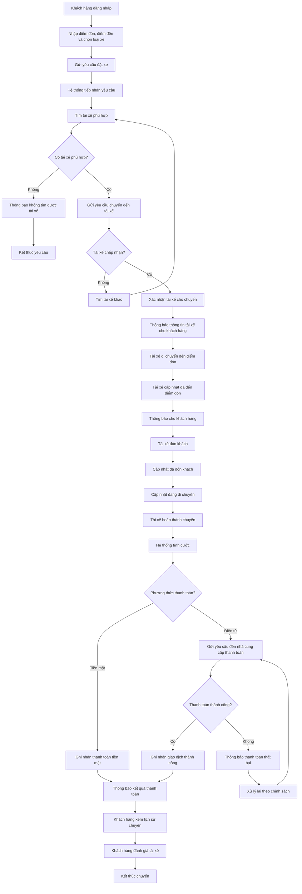

## 9.2. Quy trình đặt xe

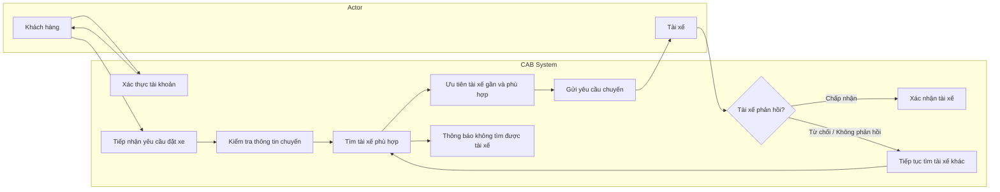

## 9.3. Quy trình thực hiện chuyến

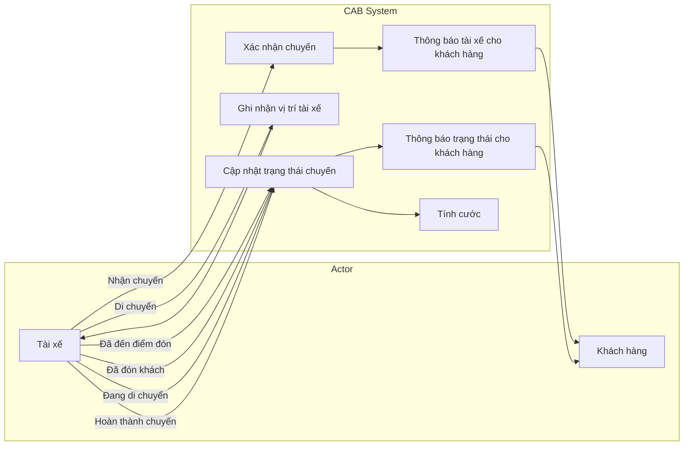

## 9.4. Quy trình tính cước và thanh toán

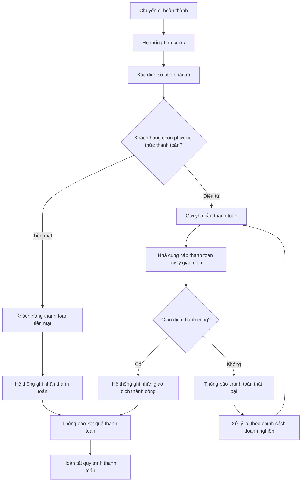

## 9.5. Quy trình thông báo

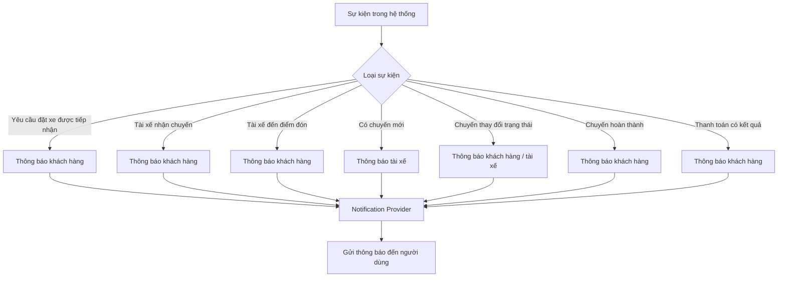

## 9.6. Quy trình sau chuyến đi

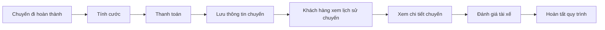

## 9.7. Quy trình quản lý và vận hành

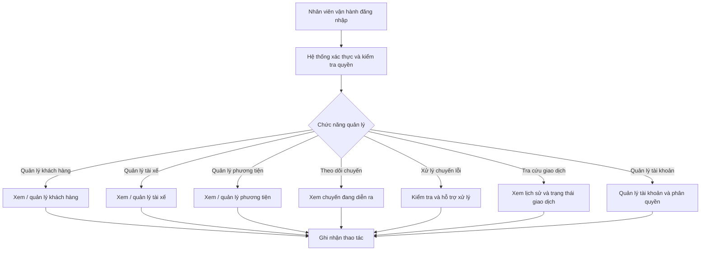

## 9.8. Quy trình báo cáo

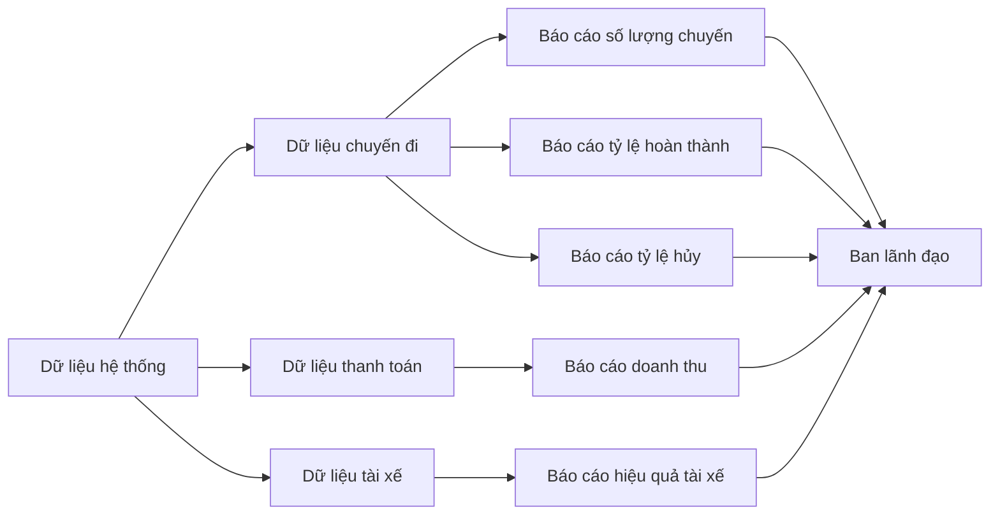

## 9.9. Quy trình xử lý các trường hợp ngoại lệ

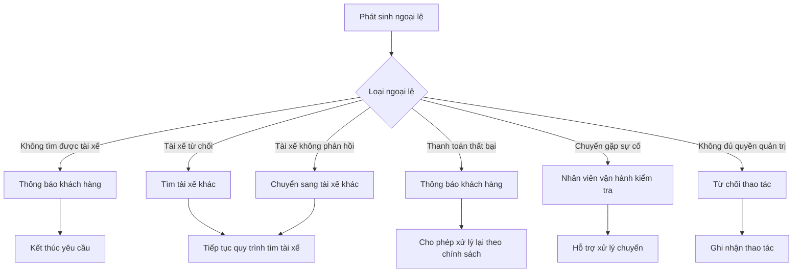

## 9.10. Các vấn đề cần làm rõ trong quy trình nghiệp vụ

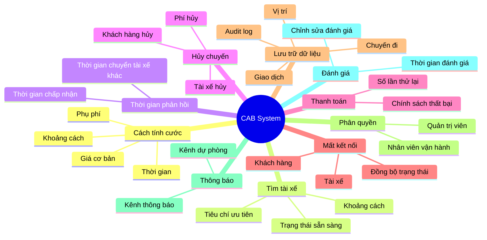

## 9.11. Tổng kết quy trình nghiệp vụ

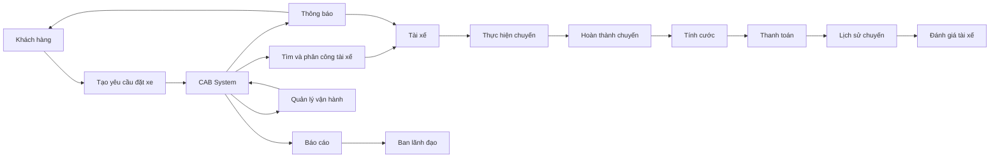
# 10.Phân tich quy tắc nghiệp vụ

Các quy tắc nghiệp vụ của hệ thống CAB được xác định dựa trên quy trình đặt xe, tìm tài xế, thực hiện chuyến, thanh toán, quản lý vận hành và các yêu cầu bảo mật của doanh nghiệp.

## 10.1. Quy tắc về tài khoản và phân quyền

| ID | Quy tắc nghiệp vụ | Mô tả |
| --- | --- | --- |
| BR-01 | Xác thực người dùng | Khách hàng và tài xế phải đăng nhập và được xác thực trước khi sử dụng các chức năng yêu cầu tài khoản. |
| BR-02 | Phân quyền theo vai trò | Người dùng chỉ được sử dụng các chức năng phù hợp với vai trò của mình. |
| BR-03 | Quyền quản trị | Chỉ nhân viên vận hành có quyền phù hợp mới được thực hiện các thao tác quản trị và thao tác nhạy cảm. |
| BR-04 | Quản lý tài khoản tài xế | Tài xế có thể tự đăng ký hoặc được nhân viên vận hành tạo tài khoản. |
| BR-05 | Cập nhật thông tin | Khách hàng và tài xế được phép cập nhật thông tin cá nhân của mình theo quyền được cấp. |

## 10.2. Quy tắc về đặt xe

| ID | Quy tắc nghiệp vụ | Mô tả |
| --- | --- | --- |
| BR-06 | Thông tin đặt xe bắt buộc | Một yêu cầu đặt xe phải có điểm đón, điểm đến và loại xe được lựa chọn. |
| BR-07 | Tạo yêu cầu đặt xe | Chỉ khách hàng đã được xác thực mới có thể tạo yêu cầu đặt xe. |
| BR-08 | Tìm tài xế sau khi đặt xe | Sau khi yêu cầu đặt xe được tạo, hệ thống phải tự động tìm tài xế phù hợp. |
| BR-09 | Không yêu cầu tạo lại | Khi tài xế từ chối hoặc không phản hồi, hệ thống phải tiếp tục tìm tài xế khác mà không yêu cầu khách hàng tạo lại yêu cầu. |
| BR-10 | Không tìm được tài xế | Nếu không tìm được tài xế phù hợp, hệ thống phải thông báo rõ ràng cho khách hàng. |

## 10.3. Quy tắc về tìm và phân công tài xế

| ID | Quy tắc nghiệp vụ | Mô tả |
| --- | --- | --- |
| BR-11 | Tài xế sẵn sàng | Chỉ tài xế đang ở trạng thái sẵn sàng nhận chuyến mới được xem xét để phân công. |
| BR-12 | Tài xế phù hợp | Hệ thống lựa chọn tài xế dựa trên vị trí, trạng thái sẵn sàng và các tiêu chí vận hành đã được doanh nghiệp xác định. |
| BR-13 | Ưu tiên tài xế gần | Hệ thống ưu tiên các tài xế phù hợp và có vị trí gần điểm đón của khách hàng. |
| BR-14 | Tài xế từ chối | Nếu tài xế từ chối chuyến, hệ thống phải tiếp tục tìm tài xế khác. |
| BR-15 | Tài xế không phản hồi | Nếu tài xế không phản hồi trong khoảng thời gian được quy định, hệ thống xem yêu cầu là không được nhận và tiếp tục tìm tài xế khác. |
| BR-16 | Một chuyến chỉ có một tài xế | Một yêu cầu đặt xe chỉ được xác nhận cho một tài xế tại một thời điểm. |
| BR-17 | Xác nhận nhận chuyến | Chuyến đi chỉ được chuyển sang trạng thái đã có tài xế khi tài xế chấp nhận yêu cầu. |

## 10.4. Quy tắc về trạng thái chuyến đi

| ID | Quy tắc nghiệp vụ | Mô tả |
| --- | --- | --- |
| BR-18 | Trạng thái chờ tìm tài xế | Sau khi khách hàng tạo yêu cầu, chuyến đi ở trạng thái đang tìm tài xế cho đến khi có tài xế nhận chuyến hoặc không tìm được tài xế. |
| BR-19 | Tài xế đã nhận chuyến | Khi tài xế chấp nhận, chuyến đi được chuyển sang trạng thái tài xế đã nhận chuyến. |
| BR-20 | Tài xế đến điểm đón | Tài xế cập nhật trạng thái khi đã đến điểm đón. |
| BR-21 | Đã đón khách | Tài xế chỉ được chuyển sang trạng thái đã đón khách sau khi khách hàng được đón. |
| BR-22 | Đang di chuyển | Chuyến đi chuyển sang trạng thái đang di chuyển sau khi tài xế bắt đầu thực hiện hành trình. |
| BR-23 | Hoàn thành chuyến | Chuyến đi được chuyển sang trạng thái hoàn thành khi tài xế hoàn tất hành trình. |
| BR-24 | Theo dõi trạng thái | Khách hàng có quyền xem trạng thái hiện tại của chuyến đi. |

## 10.5. Quy tắc về vị trí tài xế

| ID | Quy tắc nghiệp vụ | Mô tả |
| --- | --- | --- |
| BR-25 | Ghi nhận vị trí | Hệ thống ghi nhận vị trí của tài xế để hỗ trợ tìm kiếm và phân công chuyến. |
| BR-26 | Vị trí phục vụ điều phối | Vị trí tài xế được sử dụng làm một trong các tiêu chí để xác định tài xế phù hợp. |
| BR-27 | Hỗ trợ dự kiến thời gian đến | Thông tin vị trí tài xế được sử dụng để hỗ trợ dự kiến thời gian tài xế đến điểm đón. |

## 10.6. Quy tắc về tính cước

| ID | Quy tắc nghiệp vụ | Mô tả |
| --- | --- | --- |
| BR-28 | Tính cước sau chuyến | Hệ thống xác định số tiền khách hàng phải trả sau khi chuyến đi hoàn thành. |
| BR-29 | Căn cứ tính cước | Số tiền phải trả được xác định dựa trên loại dịch vụ và thông tin chuyến đi. |
| BR-30 | Chính sách tính cước | Công thức tính cước chi tiết cần được doanh nghiệp xác nhận trước khi triển khai chính thức. |

## 10.7. Quy tắc về thanh toán

| ID | Quy tắc nghiệp vụ | Mô tả |
| --- | --- | --- |
| BR-31 | Thanh toán tiền mặt | Khách hàng có thể thanh toán bằng tiền mặt theo chính sách của doanh nghiệp. |
| BR-32 | Thanh toán điện tử | Khách hàng có thể thanh toán điện tử thông qua nhà cung cấp thanh toán bên ngoài. |
| BR-33 | Không lưu thông tin nhạy cảm | Hệ thống CAB không lưu trực tiếp thông tin nhạy cảm của thẻ hoặc tài khoản thanh toán. |
| BR-34 | Xử lý kết quả thanh toán | Hệ thống phải ghi nhận và cập nhật trạng thái giao dịch dựa trên kết quả từ nhà cung cấp thanh toán. |
| BR-35 | Thanh toán thất bại | Khi thanh toán điện tử thất bại, hệ thống phải thông báo cho khách hàng. |
| BR-36 | Thanh toán lại | Khi thanh toán thất bại, khách hàng có thể thực hiện lại giao dịch theo chính sách của doanh nghiệp. |
| BR-37 | Tra cứu giao dịch | Nhân viên vận hành có quyền phù hợp được phép tra cứu lịch sử và trạng thái giao dịch. |

## 10.8. Quy tắc về thông báo

| ID | Quy tắc nghiệp vụ | Mô tả |
| --- | --- | --- |
| BR-38 | Thông báo tiếp nhận | Hệ thống gửi thông báo khi yêu cầu đặt xe được tiếp nhận. |
| BR-39 | Thông báo tài xế nhận chuyến | Hệ thống gửi thông báo cho khách hàng khi có tài xế nhận chuyến. |
| BR-40 | Thông báo tài xế đến | Hệ thống gửi thông báo khi tài xế đến điểm đón. |
| BR-41 | Thông báo hoàn thành | Hệ thống gửi thông báo khi chuyến đi hoàn thành. |
| BR-42 | Thông báo thanh toán | Hệ thống gửi thông báo cho khách hàng về kết quả thanh toán. |
| BR-43 | Thông báo cho tài xế | Tài xế phải nhận được thông báo khi có chuyến mới hoặc có thay đổi liên quan đến chuyến đang thực hiện. |
| BR-44 | Khả năng mở rộng kênh thông báo | Hệ thống phải cho phép bổ sung các nhà cung cấp hoặc kênh thông báo mới mà không ảnh hưởng lớn đến các chức năng hiện tại. |

## 10.9. Quy tắc về lịch sử và đánh giá

| ID | Quy tắc nghiệp vụ | Mô tả |
| --- | --- | --- |
| BR-45 | Lưu lịch sử chuyến | Hệ thống phải lưu thông tin các chuyến đi đã thực hiện để phục vụ tra cứu. |
| BR-46 | Xem lịch sử | Khách hàng có thể xem lịch sử chuyến đi của mình. |
| BR-47 | Xem số tiền phải trả | Khách hàng có thể xem số tiền phải trả của chuyến đi. |
| BR-48 | Đánh giá sau chuyến | Khách hàng chỉ được đánh giá tài xế sau khi chuyến đi đã hoàn thành. |
| BR-49 | Gắn đánh giá với chuyến | Đánh giá phải được gắn với chuyến đi và tài xế tương ứng. |

## 10.10. Quy tắc về quản lý vận hành

| ID | Quy tắc nghiệp vụ | Mô tả |
| --- | --- | --- |
| BR-50 | Quản lý khách hàng | Nhân viên vận hành có quyền phù hợp được xem và quản lý thông tin khách hàng. |
| BR-51 | Quản lý tài xế | Nhân viên vận hành có quyền phù hợp được xem và quản lý thông tin tài xế. |
| BR-52 | Quản lý phương tiện | Nhân viên vận hành có quyền phù hợp được quản lý thông tin phương tiện. |
| BR-53 | Theo dõi chuyến đang diễn ra | Nhân viên vận hành có thể theo dõi các chuyến đang thực hiện và trạng thái tài xế. |
| BR-54 | Xử lý chuyến lỗi | Nhân viên vận hành có thể hỗ trợ xử lý các trường hợp chuyến đi gặp sự cố. |
| BR-55 | Phân quyền thao tác | Các thao tác nhạy cảm chỉ được thực hiện bởi nhân viên có quyền phù hợp. |

## 10.11. Quy tắc về báo cáo

| ID | Quy tắc nghiệp vụ | Mô tả |
| --- | --- | --- |
| BR-56 | Báo cáo số lượng chuyến | Hệ thống cung cấp số lượng chuyến theo khoảng thời gian được lựa chọn. |
| BR-57 | Báo cáo doanh thu | Hệ thống cung cấp thông tin doanh thu từ các chuyến đi. |
| BR-58 | Tỷ lệ hoàn thành | Hệ thống cung cấp tỷ lệ chuyến đi hoàn thành. |
| BR-59 | Tỷ lệ hủy | Hệ thống cung cấp tỷ lệ chuyến đi bị hủy. |
| BR-60 | Hiệu quả tài xế | Hệ thống cung cấp dữ liệu phục vụ đánh giá hiệu quả hoạt động của tài xế. |

## 10.12. Quy tắc về bảo mật và Audit

| ID | Quy tắc nghiệp vụ | Mô tả |
| --- | --- | --- |
| BR-61 | Bảo vệ thông tin cá nhân | Thông tin cá nhân của khách hàng và tài xế phải được bảo vệ. |
| BR-62 | Bảo vệ thông tin phương tiện | Thông tin phương tiện phải được bảo vệ và chỉ được truy cập bởi người có quyền. |
| BR-63 | Bảo vệ dữ liệu vị trí | Dữ liệu vị trí của tài xế phải được kiểm soát quyền truy cập. |
| BR-64 | Bảo vệ dữ liệu giao dịch | Dữ liệu liên quan đến giao dịch thanh toán phải được bảo vệ. |
| BR-65 | Ghi nhận thao tác quan trọng | Các thao tác quan trọng phải được lưu vết để phục vụ kiểm tra và xử lý sự cố. |
| BR-66 | Kiểm soát truy cập | Người dùng chỉ được truy cập dữ liệu và chức năng phù hợp với quyền được cấp. |

## 10.13. Các quy tắc cần xác nhận với khách hàng

Một số quy tắc nghiệp vụ trong yêu cầu hiện tại chưa được doanh nghiệp xác định chi tiết. Business Analyst cần làm rõ với các bên liên quan trước khi triển khai.

| ID | Nội dung cần xác nhận | Vấn đề cần làm rõ |
| --- | --- | --- |
| BR-67 | Công thức tính cước | Cách tính giá theo loại xe, quãng đường, thời gian hoặc các phụ phí khác. |
| BR-68 | Tiêu chí ưu tiên tài xế | Khoảng cách, thời gian chờ, loại xe, trạng thái tài xế hoặc các tiêu chí khác. |
| BR-69 | Thời gian phản hồi | Tài xế có bao nhiêu giây/phút để chấp nhận hoặc từ chối chuyến trước khi hệ thống chuyển sang tài xế khác. |
| BR-70 | Chính sách hủy chuyến | Ai được phép hủy, thời điểm hủy và có phát sinh phí hay không. |
| BR-71 | Xử lý mất kết nối | Cách xử lý khi khách hàng, tài xế hoặc hệ thống mất kết nối trong quá trình đặt và thực hiện chuyến. |
| BR-72 | Thanh toán thất bại | Số lần được phép thanh toán lại và các trường hợp cần nhân viên vận hành hỗ trợ. |
| BR-73 | Thời gian lưu trữ dữ liệu | Thời gian lưu trữ thông tin chuyến đi, giao dịch, vị trí và audit log. |
| BR-74 | Quyền quản trị | Xác định cụ thể các thao tác nào chỉ dành cho quản trị viên hoặc nhân viên có quyền đặc biệt. |
| BR-75 | Chính sách đánh giá | Quy định về số lần đánh giá, thời gian được phép đánh giá và cách xử lý đánh giá không hợp lệ. |

## 10.14. Luồng nghiệp vụ tổng quát

```mermaid
flowchart LR
    A["Khách hàng đăng nhập"] --> B["Nhập điểm đón, điểm đến<br/>và chọn loại xe"]
    B --> C["Tạo yêu cầu đặt xe"]
    C --> D["Hệ thống tiếp nhận yêu cầu"]
    D --> E["Tìm tài xế phù hợp"]

    E --> F{"Có tài xế phù hợp?"}

    F -- "Không" --> G["Thông báo không tìm được tài xế"]
    F -- "Có" --> H["Gửi yêu cầu đến tài xế"]

    H --> I{"Tài xế phản hồi?"}

    I -- "Từ chối" --> E
    I -- "Không phản hồi" --> E
    I -- "Chấp nhận" --> J["Xác nhận tài xế nhận chuyến"]

    J --> K["Tài xế di chuyển đến điểm đón"]
    K --> L["Tài xế cập nhật: Đã đến điểm đón"]
    L --> M["Đón khách"]
    M --> N["Cập nhật: Đang di chuyển"]
    N --> O["Hoàn thành chuyến"]

    O --> P["Hệ thống tính cước"]
    P --> Q{"Phương thức thanh toán"}

    Q -- "Tiền mặt" --> R["Ghi nhận thanh toán tiền mặt"]
    Q -- "Điện tử" --> S["Gửi giao dịch đến nhà cung cấp thanh toán"]

    S --> T{"Thanh toán thành công?"}
    T -- "Có" --> U["Ghi nhận thanh toán thành công"]
    T -- "Không" --> V["Thông báo thanh toán thất bại"]
    V --> W["Xử lý thanh toán lại theo chính sách"]

    R --> X["Lưu lịch sử chuyến"]
    U --> X
    W --> X

    X --> Y["Khách hàng đánh giá tài xế"]
```
## 10.15.Mối quan hệ giữa các quy tắc nghiệp vụ
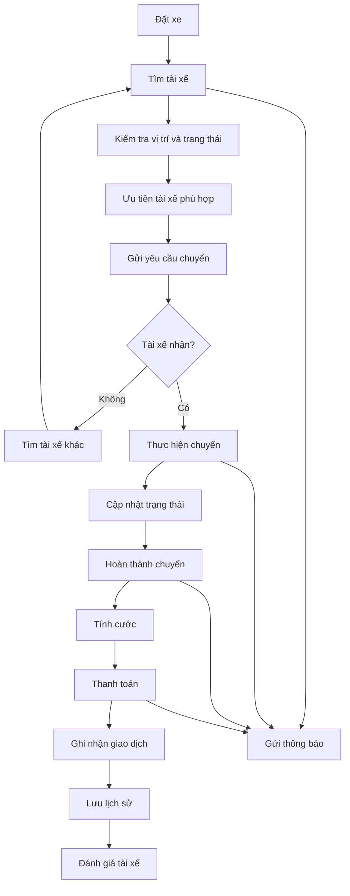

## 10.16. Tóm tắt các quy tắc nghiệp vụ

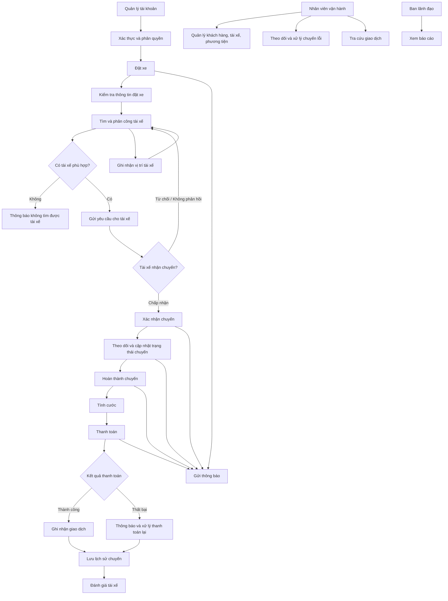

## 10.17.Các nhóm quy tắc chính
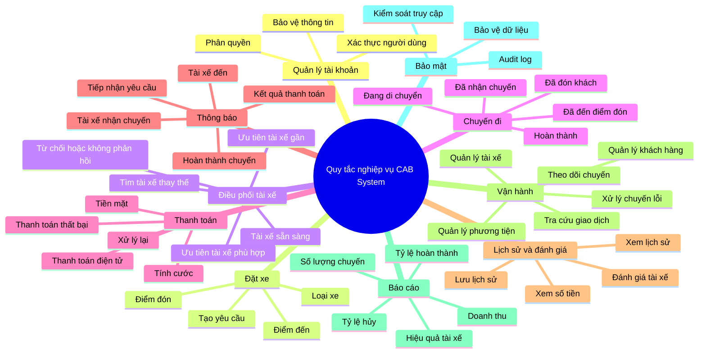
