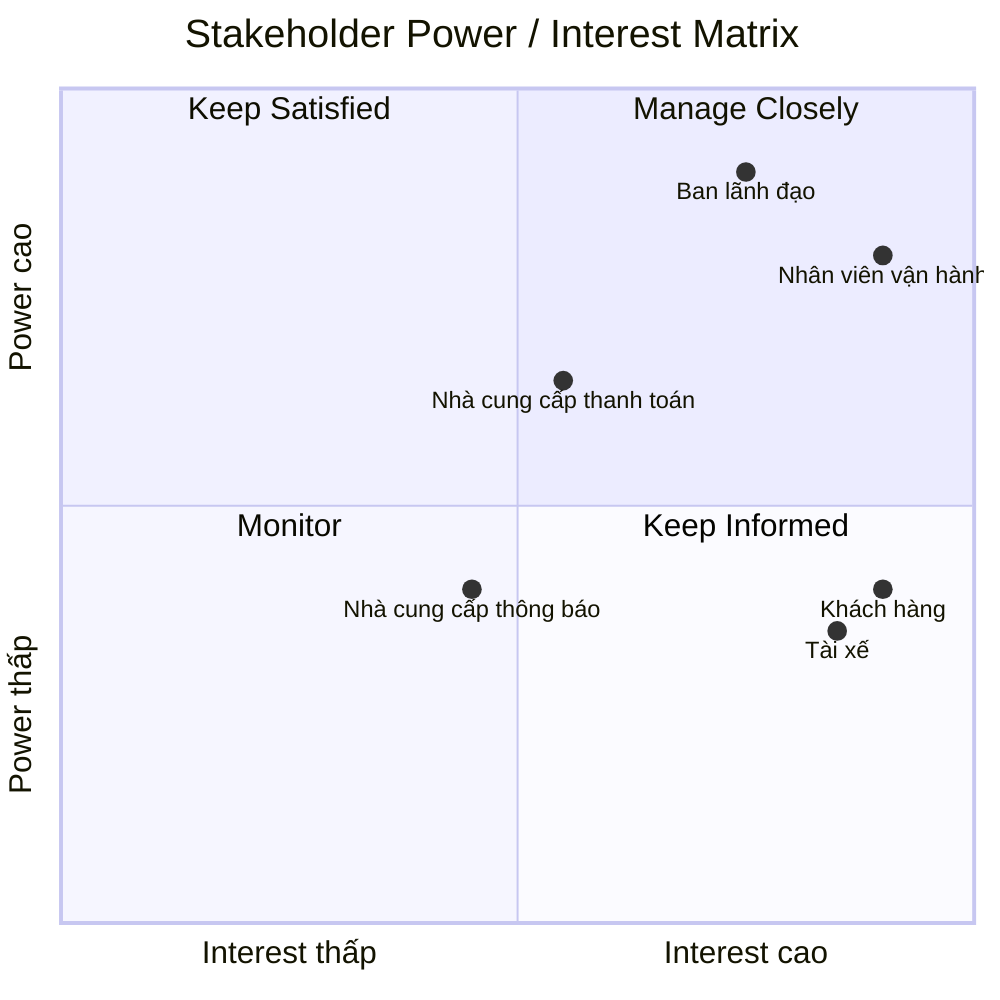
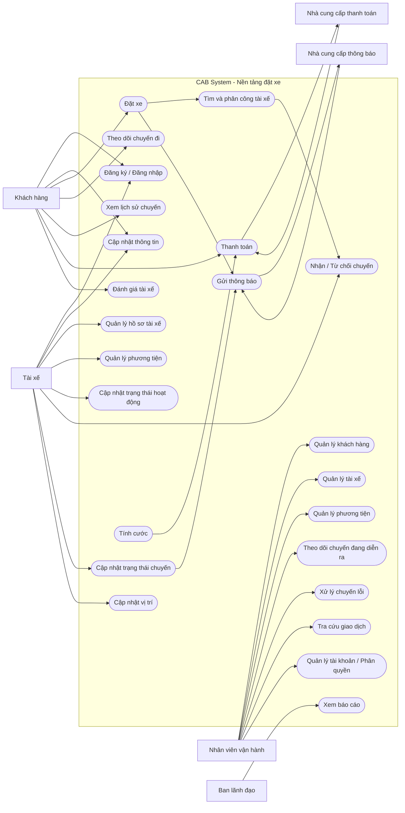

# 23655581_LeThaoUyen_cabsystem

## 1. Vấn đề và mục tiêu của doanh nghiệp
### 1.1. Vấn đề của doanh nghiệp
Hiện tại, Công ty ABC đang cung cấp dịch vụ đặt xe thông qua tổng đài và một ứng dụng đơn giản. Tuy nhiên, hệ thống hiện tại còn một số hạn chế:
- Việc phân công tài xế chủ yếu được thực hiện thủ công, gây khó khăn khi số lượng khách hàng và tài xế tăng.
- Khách hàng khó theo dõi trạng thái chuyến đi và thông tin về tài xế.
- Thông tin thanh toán chưa được quản lý tập trung.
- Bộ phận vận hành gặp khó khăn trong việc quản lý khách hàng, tài xế, phương tiện và chuyến đi.
- Hệ thống khó mở rộng khi doanh nghiệp muốn bổ sung các dịch vụ hoặc tính năng mới.
- Việc theo dõi và báo cáo tình hình hoạt động của hệ thống còn hạn chế.
### 1.2. Mục tiêu của doanh nghiệp
Doanh nghiệp mong muốn xây dựng **CAB System – Nền tảng đặt xe** nhằm:
- Tự động hóa quá trình tìm kiếm và phân công tài xế phù hợp.
- Hỗ trợ khách hàng đặt xe, theo dõi chuyến đi, thanh toán và đánh giá tài xế.
- Hỗ trợ tài xế nhận chuyến và cập nhật trạng thái trong quá trình thực hiện chuyến đi.
- Cung cấp giao diện quản trị để nhân viên vận hành quản lý khách hàng, tài xế, phương tiện và chuyến đi.
- Tích hợp thanh toán điện tử thông qua nhà cung cấp bên ngoài mà không lưu trực tiếp thông tin thanh toán nhạy cảm.
- Cung cấp hệ thống thông báo cho khách hàng và tài xế trong các trạng thái quan trọng của chuyến đi.
- Cung cấp dữ liệu và báo cáo để doanh nghiệp theo dõi hoạt động, doanh thu và hiệu quả vận hành.
- Xây dựng hệ thống có khả năng mở rộng, cho phép bổ sung dịch vụ, phương thức thanh toán và các kênh thông báo mới trong tương lai.

## 2.Xác định stakeholder-vai trò (vẽ table)
| Stakeholder | Vai trò | Mối quan tâm / Nhu cầu |
|---|---|---|
| **Khách hàng (Customer)** | Người sử dụng dịch vụ đặt xe | Đăng ký tài khoản, đặt xe, theo dõi chuyến đi, thanh toán, xem lịch sử và đánh giá tài xế |
| **Tài xế (Driver)** | Người tiếp nhận và thực hiện chuyến xe | Quản lý hồ sơ, phương tiện, nhận chuyến, cập nhật trạng thái và vị trí |
| **Nhân viên vận hành (Operator)** | Quản lý và hỗ trợ hoạt động của hệ thống | Quản lý khách hàng, tài xế, phương tiện, chuyến đi và xử lý các trường hợp phát sinh |
| **Ban lãnh đạo (Management)** | Theo dõi và đưa ra quyết định về hoạt động kinh doanh | Theo dõi số lượng chuyến, doanh thu, tỷ lệ hoàn thành, tỷ lệ hủy và hiệu quả hoạt động của tài xế |
| **Nhà cung cấp thanh toán (Payment Provider)** | Cung cấp dịch vụ thanh toán điện tử bên ngoài | Xử lý giao dịch thanh toán và trả kết quả giao dịch cho hệ thống |
| **Nhà cung cấp thông báo (Notification Provider)** | Cung cấp các kênh gửi thông báo | Gửi thông báo đến khách hàng và tài xế khi có sự kiện liên quan |

## 3.Vẽ matrix và mục đích nghiệp vụ của các bên liên quan
### 3.1.Vẽ matrix

### 3.2.Mục đích nghiệp vụ của các bên liên quan
| Stakeholder | Mục đích nghiệp vụ |
|---|---|
| **Khách hàng** | Đặt xe thuận tiện, theo dõi trạng thái chuyến đi, biết thông tin tài xế, thanh toán và đánh giá chất lượng dịch vụ. |
| **Tài xế** | Nhận các chuyến phù hợp, quản lý trạng thái hoạt động, thực hiện chuyến và cập nhật trạng thái chuyến đi. |
| **Nhân viên vận hành** | Theo dõi và điều phối chuyến xe, quản lý tài xế, khách hàng, phương tiện và xử lý các trường hợp phát sinh. |
| **Ban lãnh đạo** | Theo dõi số lượng chuyến, doanh thu, tỷ lệ hoàn thành, tỷ lệ hủy và hiệu quả hoạt động để hỗ trợ việc ra quyết định. |
| **Nhà cung cấp thanh toán** | Cung cấp dịch vụ thanh toán điện tử, xử lý giao dịch và trả kết quả thanh toán cho hệ thống CAB. |
| **Nhà cung cấp thông báo** | Cung cấp các kênh gửi thông báo đến khách hàng và tài xế khi có các sự kiện liên quan đến chuyến đi. |

## 4.Xác định phạm vi nhất định trong vòng 7 tuần
| STT | Phạm vi | Nội dung |
|---:|---|---|
| 1 | Quản lý tài khoản | Đăng ký, đăng nhập và cập nhật thông tin cá nhân của khách hàng, tài xế. |
| 2 | Đặt xe | Khách hàng nhập điểm đón, điểm đến, chọn loại xe và gửi yêu cầu đặt xe. |
| 3 | Tìm và phân công tài xế | Hệ thống tìm kiếm và phân công tài xế phù hợp dựa trên vị trí, trạng thái sẵn sàng và các tiêu chí vận hành. |
| 4 | Quản lý chuyến đi | Theo dõi và cập nhật trạng thái chuyến từ khi tài xế nhận chuyến đến khi hoàn thành. |
| 5 | Quản lý tài xế và phương tiện | Quản lý hồ sơ tài xế, thông tin phương tiện, trạng thái hoạt động và vị trí tài xế. |
| 6 | Tính cước và thanh toán | Tính số tiền khách hàng phải trả, hỗ trợ thanh toán tiền mặt và thanh toán điện tử thông qua nhà cung cấp bên ngoài. |
| 7 | Thông báo | Gửi thông báo cho khách hàng và tài xế về các trạng thái quan trọng của chuyến đi và kết quả thanh toán. |
| 8 | Lịch sử và đánh giá | Khách hàng xem lịch sử chuyến đi, số tiền phải trả và đánh giá tài xế sau khi hoàn thành chuyến. |
| 9 | Quản trị và vận hành | Nhân viên vận hành quản lý khách hàng, tài xế, phương tiện, chuyến đi và hỗ trợ xử lý các trường hợp phát sinh. |
| 10 | Báo cáo | Cung cấp báo cáo về số lượng chuyến, doanh thu, tỷ lệ hoàn thành, tỷ lệ hủy và hiệu quả hoạt động của tài xế. |

## 5.Chuyển thành yêu cầu doanh nghiệp
| ID | Yêu cầu doanh nghiệp | Mô tả |
|---|---|---|
| BR-01 | Tự động hóa quy trình đặt xe | Hệ thống hỗ trợ tự động hóa quy trình từ khi khách hàng tạo yêu cầu đặt xe đến khi chuyến đi hoàn thành. |
| BR-02 | Nâng cao trải nghiệm khách hàng | Hệ thống cho phép khách hàng đặt xe, theo dõi trạng thái chuyến đi, biết thông tin tài xế và xem lịch sử chuyến. |
| BR-03 | Tự động hóa điều phối tài xế | Hệ thống tự động tìm kiếm và phân công tài xế phù hợp dựa trên vị trí, trạng thái sẵn sàng và các tiêu chí vận hành. |
| BR-04 | Quản lý tập trung | Hệ thống hỗ trợ doanh nghiệp quản lý tập trung khách hàng, tài xế, phương tiện và chuyến đi. |
| BR-05 | Hỗ trợ thanh toán | Hệ thống hỗ trợ tính cước và thanh toán bằng tiền mặt hoặc phương thức thanh toán điện tử thông qua nhà cung cấp bên ngoài. |
| BR-06 | Cung cấp thông báo | Hệ thống gửi thông báo cho khách hàng và tài xế về các trạng thái quan trọng của chuyến đi và kết quả thanh toán. |
| BR-07 | Hỗ trợ quản lý vận hành | Hệ thống giúp nhân viên vận hành theo dõi chuyến đi, quản lý tài xế và xử lý các trường hợp phát sinh. |
| BR-08 | Cung cấp báo cáo | Hệ thống cung cấp thông tin về số lượng chuyến, doanh thu, tỷ lệ hoàn thành, tỷ lệ hủy và hiệu quả hoạt động của tài xế. |
| BR-09 | Đảm bảo bảo mật | Hệ thống bảo vệ thông tin cá nhân, thông tin phương tiện, dữ liệu vị trí và dữ liệu giao dịch của người dùng. |
| BR-10 | Có khả năng mở rộng | Hệ thống có khả năng mở rộng để hỗ trợ thêm dịch vụ, phương thức thanh toán, nhà cung cấp thông báo và các thành phần kỹ thuật mới trong tương lai. |

## 6.Functional Requirements
## 6.1. Quản lý tài khoản
| ID | Chức năng | Mô tả |
|---|---|---|
| FR-01 | Đăng ký tài khoản | Khách hàng có thể đăng ký tài khoản; tài xế có thể đăng ký hoặc được nhân viên vận hành tạo tài khoản. |
| FR-02 | Đăng nhập | Người dùng có tài khoản có thể đăng nhập vào hệ thống. |
| FR-03 | Cập nhật thông tin | Khách hàng và tài xế có thể xem, cập nhật thông tin cá nhân. |
| FR-04 | Phân quyền | Hệ thống phân quyền người dùng theo vai trò và kiểm soát các chức năng quản trị. |
## 6.2. Quản lý tài xế và phương tiện
| ID | Chức năng | Mô tả |
|---|---|---|
| FR-05 | Quản lý hồ sơ tài xế | Tài xế có thể cập nhật thông tin hồ sơ cá nhân. |
| FR-06 | Quản lý phương tiện | Tài xế có thể cập nhật thông tin phương tiện. |
| FR-07 | Trạng thái hoạt động | Tài xế có thể chuyển sang trạng thái sẵn sàng hoặc không sẵn sàng nhận chuyến. |
| FR-08 | Cập nhật vị trí | Hệ thống ghi nhận vị trí của tài xế để hỗ trợ tìm tài xế và dự kiến thời gian đến. |
## 6.3. Đặt xe
| ID | Chức năng | Mô tả |
|---|---|---|
| FR-09 | Nhập điểm đón | Khách hàng nhập địa điểm đón. |
| FR-10 | Nhập điểm đến | Khách hàng nhập địa điểm cần đến. |
| FR-11 | Chọn loại xe | Khách hàng lựa chọn loại xe phù hợp. |
| FR-12 | Tạo yêu cầu đặt xe | Khách hàng gửi yêu cầu đặt xe đến hệ thống. |
| FR-13 | Theo dõi yêu cầu | Khách hàng có thể theo dõi trạng thái yêu cầu đặt xe. |
## 6.4. Tìm và phân công tài xế
| ID | Chức năng | Mô tả |
|---|---|---|
| FR-14 | Tìm tài xế | Hệ thống tìm các tài xế phù hợp dựa trên vị trí và trạng thái sẵn sàng. |
| FR-15 | Ưu tiên tài xế | Hệ thống ưu tiên tài xế phù hợp và gần khách hàng theo các tiêu chí vận hành. |
| FR-16 | Gửi yêu cầu chuyến | Hệ thống gửi thông tin yêu cầu chuyến đến tài xế phù hợp. |
| FR-17 | Chấp nhận chuyến | Tài xế có thể chấp nhận yêu cầu chuyến. |
| FR-18 | Từ chối chuyến | Tài xế có thể từ chối yêu cầu chuyến. |
| FR-19 | Tìm tài xế thay thế | Nếu tài xế từ chối hoặc không phản hồi, hệ thống tiếp tục tìm tài xế khác. |
| FR-20 | Thông báo không tìm được tài xế | Hệ thống thông báo cho khách hàng khi không tìm được tài xế phù hợp. |
## 6.5. Quản lý chuyến đi
| ID | Chức năng | Mô tả |
|---|---|---|
| FR-21 | Xác nhận chuyến | Hệ thống xác nhận khi tài xế nhận chuyến. |
| FR-22 | Cập nhật trạng thái | Tài xế có thể cập nhật trạng thái của chuyến đi. |
| FR-23 | Đã đến điểm đón | Tài xế cập nhật trạng thái khi đã đến điểm đón. |
| FR-24 | Đã đón khách | Tài xế cập nhật trạng thái khi đã đón khách. |
| FR-25 | Đang di chuyển | Tài xế cập nhật trạng thái khi bắt đầu di chuyển. |
| FR-26 | Hoàn thành chuyến | Tài xế cập nhật trạng thái khi chuyến đi hoàn thành. |
| FR-27 | Theo dõi chuyến | Khách hàng có thể theo dõi trạng thái hiện tại của chuyến đi. |
## 6.6. Tính cước và thanh toán
| ID | Chức năng | Mô tả |
|---|---|---|
| FR-28 | Tính cước | Hệ thống xác định số tiền khách hàng phải trả dựa trên loại dịch vụ và thông tin chuyến đi. |
| FR-29 | Thanh toán tiền mặt | Khách hàng có thể thanh toán bằng tiền mặt. |
| FR-30 | Thanh toán điện tử | Khách hàng có thể thanh toán điện tử thông qua nhà cung cấp thanh toán bên ngoài. |
| FR-31 | Xử lý thanh toán thất bại | Hệ thống thông báo cho khách hàng khi thanh toán điện tử thất bại và cho phép xử lý lại theo chính sách của doanh nghiệp. |
| FR-32 | Tra cứu giao dịch | Nhân viên vận hành có quyền có thể tra cứu lịch sử và trạng thái giao dịch. |
## 6.7. Thông báo
| ID | Chức năng | Mô tả |
|---|---|---|
| FR-33 | Thông báo tiếp nhận yêu cầu | Hệ thống thông báo khi yêu cầu đặt xe được tiếp nhận. |
| FR-34 | Thông báo tài xế nhận chuyến | Hệ thống thông báo khi có tài xế nhận chuyến. |
| FR-35 | Thông báo tài xế đến điểm đón | Hệ thống thông báo khi tài xế đến điểm đón. |
| FR-36 | Thông báo hoàn thành chuyến | Hệ thống thông báo khi chuyến đi hoàn thành. |
| FR-37 | Thông báo kết quả thanh toán | Hệ thống thông báo cho khách hàng về kết quả thanh toán. |
| FR-38 | Thông báo chuyến mới | Tài xế nhận thông báo khi có yêu cầu chuyến mới hoặc thay đổi liên quan đến chuyến đang thực hiện. |
## 6.8. Lịch sử và đánh giá
| ID | Chức năng | Mô tả |
|---|---|---|
| FR-39 | Xem lịch sử chuyến | Khách hàng có thể xem lịch sử các chuyến đi đã thực hiện. |
| FR-40 | Xem chi tiết chuyến | Khách hàng có thể xem thông tin chi tiết và số tiền phải trả của chuyến đi. |
| FR-41 | Đánh giá tài xế | Khách hàng có thể đánh giá tài xế sau khi chuyến đi hoàn thành. |
## 6.9. Quản trị và vận hành
| ID | Chức năng | Mô tả |
|---|---|---|
| FR-42 | Quản lý khách hàng | Nhân viên vận hành có thể xem và quản lý thông tin khách hàng. |
| FR-43 | Quản lý tài xế | Nhân viên vận hành có thể xem và quản lý thông tin tài xế. |
| FR-44 | Quản lý phương tiện | Nhân viên vận hành có thể quản lý thông tin phương tiện. |
| FR-45 | Theo dõi chuyến đang diễn ra | Nhân viên vận hành có thể xem các chuyến đang thực hiện và trạng thái tài xế. |
| FR-46 | Xử lý chuyến lỗi | Nhân viên vận hành có thể hỗ trợ xử lý các trường hợp chuyến đi gặp sự cố. |
| FR-47 | Quản lý tài khoản | Nhân viên vận hành có quyền quản trị có thể quản lý tài khoản người dùng. |
| FR-48 | Phân quyền người dùng | Nhân viên vận hành có quyền quản trị có thể phân quyền cho các vai trò phù hợp. |
## 6.10. Báo cáo
| ID | Chức năng | Mô tả |
|---|---|---|
| FR-49 | Báo cáo số lượng chuyến | Hệ thống cung cấp báo cáo về số lượng chuyến. |
| FR-50 | Báo cáo doanh thu | Hệ thống cung cấp báo cáo về doanh thu. |
| FR-51 | Tỷ lệ hoàn thành | Hệ thống cung cấp tỷ lệ chuyến đi hoàn thành. |
| FR-52 | Tỷ lệ hủy | Hệ thống cung cấp tỷ lệ chuyến đi bị hủy. |
| FR-53 | Hiệu quả tài xế | Hệ thống cung cấp thông tin về hiệu quả hoạt động của tài xế. |
## 6.11. Xác thực và Audit
| ID | Chức năng | Mô tả |
|---|---|---|
| FR-54 | Xác thực người dùng | Hệ thống yêu cầu khách hàng và tài xế xác thực trước khi sử dụng các chức năng yêu cầu tài khoản. |
| FR-55 | Kiểm soát quyền truy cập | Hệ thống kiểm tra quyền trước khi người dùng thực hiện các chức năng quản trị. |
| FR-56 | Ghi nhận thao tác | Hệ thống lưu vết các thao tác quan trọng để phục vụ kiểm tra và xử lý sự cố. |

## 7.Vẽ usecase

# 8.Đặc tả usecase

# 9.Phân tích quy trình nghiệp vụ

# 10.Phân tich quy tắc nghiệp vụ

Các quy tắc nghiệp vụ của hệ thống CAB được xác định dựa trên quy trình đặt xe, tìm tài xế, thực hiện chuyến, thanh toán, quản lý vận hành và các yêu cầu bảo mật của doanh nghiệp.

## 10.1. Quy tắc về tài khoản và phân quyền

| ID | Quy tắc nghiệp vụ | Mô tả |
| --- | --- | --- |
| BR-01 | Xác thực người dùng | Khách hàng và tài xế phải đăng nhập và được xác thực trước khi sử dụng các chức năng yêu cầu tài khoản. |
| BR-02 | Phân quyền theo vai trò | Người dùng chỉ được sử dụng các chức năng phù hợp với vai trò của mình. |
| BR-03 | Quyền quản trị | Chỉ nhân viên vận hành có quyền phù hợp mới được thực hiện các thao tác quản trị và thao tác nhạy cảm. |
| BR-04 | Quản lý tài khoản tài xế | Tài xế có thể tự đăng ký hoặc được nhân viên vận hành tạo tài khoản. |
| BR-05 | Cập nhật thông tin | Khách hàng và tài xế được phép cập nhật thông tin cá nhân của mình theo quyền được cấp. |

## 10.2. Quy tắc về đặt xe

| ID | Quy tắc nghiệp vụ | Mô tả |
| --- | --- | --- |
| BR-06 | Thông tin đặt xe bắt buộc | Một yêu cầu đặt xe phải có điểm đón, điểm đến và loại xe được lựa chọn. |
| BR-07 | Tạo yêu cầu đặt xe | Chỉ khách hàng đã được xác thực mới có thể tạo yêu cầu đặt xe. |
| BR-08 | Tìm tài xế sau khi đặt xe | Sau khi yêu cầu đặt xe được tạo, hệ thống phải tự động tìm tài xế phù hợp. |
| BR-09 | Không yêu cầu tạo lại | Khi tài xế từ chối hoặc không phản hồi, hệ thống phải tiếp tục tìm tài xế khác mà không yêu cầu khách hàng tạo lại yêu cầu. |
| BR-10 | Không tìm được tài xế | Nếu không tìm được tài xế phù hợp, hệ thống phải thông báo rõ ràng cho khách hàng. |

## 10.3. Quy tắc về tìm và phân công tài xế

| ID | Quy tắc nghiệp vụ | Mô tả |
| --- | --- | --- |
| BR-11 | Tài xế sẵn sàng | Chỉ tài xế đang ở trạng thái sẵn sàng nhận chuyến mới được xem xét để phân công. |
| BR-12 | Tài xế phù hợp | Hệ thống lựa chọn tài xế dựa trên vị trí, trạng thái sẵn sàng và các tiêu chí vận hành đã được doanh nghiệp xác định. |
| BR-13 | Ưu tiên tài xế gần | Hệ thống ưu tiên các tài xế phù hợp và có vị trí gần điểm đón của khách hàng. |
| BR-14 | Tài xế từ chối | Nếu tài xế từ chối chuyến, hệ thống phải tiếp tục tìm tài xế khác. |
| BR-15 | Tài xế không phản hồi | Nếu tài xế không phản hồi trong khoảng thời gian được quy định, hệ thống xem yêu cầu là không được nhận và tiếp tục tìm tài xế khác. |
| BR-16 | Một chuyến chỉ có một tài xế | Một yêu cầu đặt xe chỉ được xác nhận cho một tài xế tại một thời điểm. |
| BR-17 | Xác nhận nhận chuyến | Chuyến đi chỉ được chuyển sang trạng thái đã có tài xế khi tài xế chấp nhận yêu cầu. |

## 10.4. Quy tắc về trạng thái chuyến đi

| ID | Quy tắc nghiệp vụ | Mô tả |
| --- | --- | --- |
| BR-18 | Trạng thái chờ tìm tài xế | Sau khi khách hàng tạo yêu cầu, chuyến đi ở trạng thái đang tìm tài xế cho đến khi có tài xế nhận chuyến hoặc không tìm được tài xế. |
| BR-19 | Tài xế đã nhận chuyến | Khi tài xế chấp nhận, chuyến đi được chuyển sang trạng thái tài xế đã nhận chuyến. |
| BR-20 | Tài xế đến điểm đón | Tài xế cập nhật trạng thái khi đã đến điểm đón. |
| BR-21 | Đã đón khách | Tài xế chỉ được chuyển sang trạng thái đã đón khách sau khi khách hàng được đón. |
| BR-22 | Đang di chuyển | Chuyến đi chuyển sang trạng thái đang di chuyển sau khi tài xế bắt đầu thực hiện hành trình. |
| BR-23 | Hoàn thành chuyến | Chuyến đi được chuyển sang trạng thái hoàn thành khi tài xế hoàn tất hành trình. |
| BR-24 | Theo dõi trạng thái | Khách hàng có quyền xem trạng thái hiện tại của chuyến đi. |

## 10.5. Quy tắc về vị trí tài xế

| ID | Quy tắc nghiệp vụ | Mô tả |
| --- | --- | --- |
| BR-25 | Ghi nhận vị trí | Hệ thống ghi nhận vị trí của tài xế để hỗ trợ tìm kiếm và phân công chuyến. |
| BR-26 | Vị trí phục vụ điều phối | Vị trí tài xế được sử dụng làm một trong các tiêu chí để xác định tài xế phù hợp. |
| BR-27 | Hỗ trợ dự kiến thời gian đến | Thông tin vị trí tài xế được sử dụng để hỗ trợ dự kiến thời gian tài xế đến điểm đón. |

## 10.6. Quy tắc về tính cước

| ID | Quy tắc nghiệp vụ | Mô tả |
| --- | --- | --- |
| BR-28 | Tính cước sau chuyến | Hệ thống xác định số tiền khách hàng phải trả sau khi chuyến đi hoàn thành. |
| BR-29 | Căn cứ tính cước | Số tiền phải trả được xác định dựa trên loại dịch vụ và thông tin chuyến đi. |
| BR-30 | Chính sách tính cước | Công thức tính cước chi tiết cần được doanh nghiệp xác nhận trước khi triển khai chính thức. |

## 10.7. Quy tắc về thanh toán

| ID | Quy tắc nghiệp vụ | Mô tả |
| --- | --- | --- |
| BR-31 | Thanh toán tiền mặt | Khách hàng có thể thanh toán bằng tiền mặt theo chính sách của doanh nghiệp. |
| BR-32 | Thanh toán điện tử | Khách hàng có thể thanh toán điện tử thông qua nhà cung cấp thanh toán bên ngoài. |
| BR-33 | Không lưu thông tin nhạy cảm | Hệ thống CAB không lưu trực tiếp thông tin nhạy cảm của thẻ hoặc tài khoản thanh toán. |
| BR-34 | Xử lý kết quả thanh toán | Hệ thống phải ghi nhận và cập nhật trạng thái giao dịch dựa trên kết quả từ nhà cung cấp thanh toán. |
| BR-35 | Thanh toán thất bại | Khi thanh toán điện tử thất bại, hệ thống phải thông báo cho khách hàng. |
| BR-36 | Thanh toán lại | Khi thanh toán thất bại, khách hàng có thể thực hiện lại giao dịch theo chính sách của doanh nghiệp. |
| BR-37 | Tra cứu giao dịch | Nhân viên vận hành có quyền phù hợp được phép tra cứu lịch sử và trạng thái giao dịch. |

## 10.8. Quy tắc về thông báo

| ID | Quy tắc nghiệp vụ | Mô tả |
| --- | --- | --- |
| BR-38 | Thông báo tiếp nhận | Hệ thống gửi thông báo khi yêu cầu đặt xe được tiếp nhận. |
| BR-39 | Thông báo tài xế nhận chuyến | Hệ thống gửi thông báo cho khách hàng khi có tài xế nhận chuyến. |
| BR-40 | Thông báo tài xế đến | Hệ thống gửi thông báo khi tài xế đến điểm đón. |
| BR-41 | Thông báo hoàn thành | Hệ thống gửi thông báo khi chuyến đi hoàn thành. |
| BR-42 | Thông báo thanh toán | Hệ thống gửi thông báo cho khách hàng về kết quả thanh toán. |
| BR-43 | Thông báo cho tài xế | Tài xế phải nhận được thông báo khi có chuyến mới hoặc có thay đổi liên quan đến chuyến đang thực hiện. |
| BR-44 | Khả năng mở rộng kênh thông báo | Hệ thống phải cho phép bổ sung các nhà cung cấp hoặc kênh thông báo mới mà không ảnh hưởng lớn đến các chức năng hiện tại. |

## 10.9. Quy tắc về lịch sử và đánh giá

| ID | Quy tắc nghiệp vụ | Mô tả |
| --- | --- | --- |
| BR-45 | Lưu lịch sử chuyến | Hệ thống phải lưu thông tin các chuyến đi đã thực hiện để phục vụ tra cứu. |
| BR-46 | Xem lịch sử | Khách hàng có thể xem lịch sử chuyến đi của mình. |
| BR-47 | Xem số tiền phải trả | Khách hàng có thể xem số tiền phải trả của chuyến đi. |
| BR-48 | Đánh giá sau chuyến | Khách hàng chỉ được đánh giá tài xế sau khi chuyến đi đã hoàn thành. |
| BR-49 | Gắn đánh giá với chuyến | Đánh giá phải được gắn với chuyến đi và tài xế tương ứng. |

## 10.10. Quy tắc về quản lý vận hành

| ID | Quy tắc nghiệp vụ | Mô tả |
| --- | --- | --- |
| BR-50 | Quản lý khách hàng | Nhân viên vận hành có quyền phù hợp được xem và quản lý thông tin khách hàng. |
| BR-51 | Quản lý tài xế | Nhân viên vận hành có quyền phù hợp được xem và quản lý thông tin tài xế. |
| BR-52 | Quản lý phương tiện | Nhân viên vận hành có quyền phù hợp được quản lý thông tin phương tiện. |
| BR-53 | Theo dõi chuyến đang diễn ra | Nhân viên vận hành có thể theo dõi các chuyến đang thực hiện và trạng thái tài xế. |
| BR-54 | Xử lý chuyến lỗi | Nhân viên vận hành có thể hỗ trợ xử lý các trường hợp chuyến đi gặp sự cố. |
| BR-55 | Phân quyền thao tác | Các thao tác nhạy cảm chỉ được thực hiện bởi nhân viên có quyền phù hợp. |

## 10.11. Quy tắc về báo cáo

| ID | Quy tắc nghiệp vụ | Mô tả |
| --- | --- | --- |
| BR-56 | Báo cáo số lượng chuyến | Hệ thống cung cấp số lượng chuyến theo khoảng thời gian được lựa chọn. |
| BR-57 | Báo cáo doanh thu | Hệ thống cung cấp thông tin doanh thu từ các chuyến đi. |
| BR-58 | Tỷ lệ hoàn thành | Hệ thống cung cấp tỷ lệ chuyến đi hoàn thành. |
| BR-59 | Tỷ lệ hủy | Hệ thống cung cấp tỷ lệ chuyến đi bị hủy. |
| BR-60 | Hiệu quả tài xế | Hệ thống cung cấp dữ liệu phục vụ đánh giá hiệu quả hoạt động của tài xế. |

## 10.12. Quy tắc về bảo mật và Audit

| ID | Quy tắc nghiệp vụ | Mô tả |
| --- | --- | --- |
| BR-61 | Bảo vệ thông tin cá nhân | Thông tin cá nhân của khách hàng và tài xế phải được bảo vệ. |
| BR-62 | Bảo vệ thông tin phương tiện | Thông tin phương tiện phải được bảo vệ và chỉ được truy cập bởi người có quyền. |
| BR-63 | Bảo vệ dữ liệu vị trí | Dữ liệu vị trí của tài xế phải được kiểm soát quyền truy cập. |
| BR-64 | Bảo vệ dữ liệu giao dịch | Dữ liệu liên quan đến giao dịch thanh toán phải được bảo vệ. |
| BR-65 | Ghi nhận thao tác quan trọng | Các thao tác quan trọng phải được lưu vết để phục vụ kiểm tra và xử lý sự cố. |
| BR-66 | Kiểm soát truy cập | Người dùng chỉ được truy cập dữ liệu và chức năng phù hợp với quyền được cấp. |

## 10.13. Các quy tắc cần xác nhận với khách hàng

Một số quy tắc nghiệp vụ trong yêu cầu hiện tại chưa được doanh nghiệp xác định chi tiết. Business Analyst cần làm rõ với các bên liên quan trước khi triển khai.

| ID | Nội dung cần xác nhận | Vấn đề cần làm rõ |
| --- | --- | --- |
| BR-67 | Công thức tính cước | Cách tính giá theo loại xe, quãng đường, thời gian hoặc các phụ phí khác. |
| BR-68 | Tiêu chí ưu tiên tài xế | Khoảng cách, thời gian chờ, loại xe, trạng thái tài xế hoặc các tiêu chí khác. |
| BR-69 | Thời gian phản hồi | Tài xế có bao nhiêu giây/phút để chấp nhận hoặc từ chối chuyến trước khi hệ thống chuyển sang tài xế khác. |
| BR-70 | Chính sách hủy chuyến | Ai được phép hủy, thời điểm hủy và có phát sinh phí hay không. |
| BR-71 | Xử lý mất kết nối | Cách xử lý khi khách hàng, tài xế hoặc hệ thống mất kết nối trong quá trình đặt và thực hiện chuyến. |
| BR-72 | Thanh toán thất bại | Số lần được phép thanh toán lại và các trường hợp cần nhân viên vận hành hỗ trợ. |
| BR-73 | Thời gian lưu trữ dữ liệu | Thời gian lưu trữ thông tin chuyến đi, giao dịch, vị trí và audit log. |
| BR-74 | Quyền quản trị | Xác định cụ thể các thao tác nào chỉ dành cho quản trị viên hoặc nhân viên có quyền đặc biệt. |
| BR-75 | Chính sách đánh giá | Quy định về số lần đánh giá, thời gian được phép đánh giá và cách xử lý đánh giá không hợp lệ. |

## 10.14. Luồng nghiệp vụ tổng quát

```mermaid
flowchart LR
    A["Khách hàng đăng nhập"] --> B["Nhập điểm đón, điểm đến<br/>và chọn loại xe"]
    B --> C["Tạo yêu cầu đặt xe"]
    C --> D["Hệ thống tiếp nhận yêu cầu"]
    D --> E["Tìm tài xế phù hợp"]

    E --> F{"Có tài xế phù hợp?"}

    F -- "Không" --> G["Thông báo không tìm được tài xế"]
    F -- "Có" --> H["Gửi yêu cầu đến tài xế"]

    H --> I{"Tài xế phản hồi?"}

    I -- "Từ chối" --> E
    I -- "Không phản hồi" --> E
    I -- "Chấp nhận" --> J["Xác nhận tài xế nhận chuyến"]

    J --> K["Tài xế di chuyển đến điểm đón"]
    K --> L["Tài xế cập nhật: Đã đến điểm đón"]
    L --> M["Đón khách"]
    M --> N["Cập nhật: Đang di chuyển"]
    N --> O["Hoàn thành chuyến"]

    O --> P["Hệ thống tính cước"]
    P --> Q{"Phương thức thanh toán"}

    Q -- "Tiền mặt" --> R["Ghi nhận thanh toán tiền mặt"]
    Q -- "Điện tử" --> S["Gửi giao dịch đến nhà cung cấp thanh toán"]

    S --> T{"Thanh toán thành công?"}
    T -- "Có" --> U["Ghi nhận thanh toán thành công"]
    T -- "Không" --> V["Thông báo thanh toán thất bại"]
    V --> W["Xử lý thanh toán lại theo chính sách"]

    R --> X["Lưu lịch sử chuyến"]
    U --> X
    W --> X

    X --> Y["Khách hàng đánh giá tài xế"]
```


## 10.15.Mối quan hệ giữa các quy tắc nghiệp vụ
```mermaid
flowchart TD
    A["Đặt xe"] --> B["Tìm tài xế"]
    B --> C["Kiểm tra vị trí và trạng thái"]
    C --> D["Ưu tiên tài xế phù hợp"]

    D --> E["Gửi yêu cầu chuyến"]
    E --> F{"Tài xế nhận?"}

    F -- "Không" --> G["Tìm tài xế khác"]
    G --> B

    F -- "Có" --> H["Thực hiện chuyến"]
    H --> I["Cập nhật trạng thái"]
    I --> J["Hoàn thành chuyến"]

    J --> K["Tính cước"]
    K --> L["Thanh toán"]

    L --> M["Ghi nhận giao dịch"]
    M --> N["Lưu lịch sử"]
    N --> O["Đánh giá tài xế"]

    B --> P["Gửi thông báo"]
    H --> P
    J --> P
    L --> P
    ```
