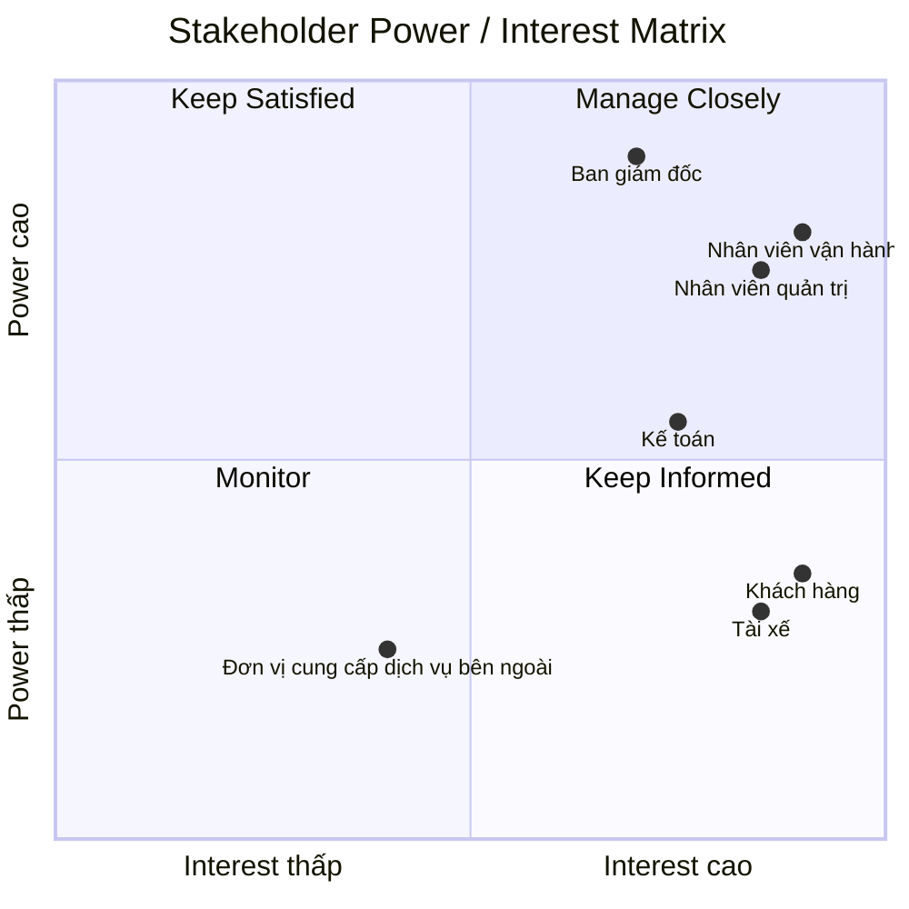

# 23655581_LeThaoUyen_capsystem
# 1.Vấn đề của doanh nghiệp:
- Công ty ABC cần xây dựng một nền tảng CAB System để tự động hóa quy trình đặt và quản lý chuyến xe
- Hệ thống hỗ trợ xuyên suốt từ tạo yêu cầu đặt xe → tìm và phân công tài xế → thực hiện chuyến → tính cước → thanh toán → đánh giá
- Hỗ trợ khách hàng theo dõi trạng thái chuyến đi và thông tin tài xế
- Hỗ trợ doanh nghiệp quản lý khách hàng, tài xế, phương tiện, chuyến đi và giao dịch tập trung
- Tự động hóa việc tìm kiếm và điều phối tài xế, bao gồm xử lý trường hợp tài xế từ chối hoặc không phản hồi
- Đảm bảo bảo mật thông tin người dùng, dữ liệu vị trí và dữ liệu giao dịch
- Hệ thống cần ổn định, có khả năng mở rộng khi số lượng khách hàng và tài xế tăng
- Có khả năng tích hợp thêm phương thức thanh toán, kênh thông báo và các dịch vụ mới trong tương lai
- Hỗ trợ doanh nghiệp theo dõi hoạt động và báo cáo để phục vụ công tác vận hành và quản lý

#   Mục tiêu của doanh nghiệp:
- Tự động hóa quy trình đặt xe và điều phối tài xế
- Nâng cao trải nghiệm khách hàng thông qua việc theo dõi chuyến đi và cập nhật trạng thái rõ ràng
- Giảm tải các công việc thủ công cho bộ phận vận hành
- Quản lý tập trung khách hàng, tài xế, phương tiện, chuyến đi và giao dịch
- Nâng cao hiệu quả sử dụng và phân công tài xế
- Đảm bảo hệ thống hoạt động ổn định khi số lượng khách hàng và tài xế tăng
- Bảo vệ thông tin cá nhân, dữ liệu vị trí và thông tin giao dịch
- Cung cấp dữ liệu và báo cáo để doanh nghiệp theo dõi hiệu quả hoạt động
- Tạo nền tảng linh hoạt để mở rộng thêm dịch vụ, phương thức thanh toán và kênh thông báo trong tương lai

# 2.Xác định stakeholder-vai trò (vẽ table):
| Stakeholder | Vai trò |
|---|---|
| Khách hàng | Đăng ký tài khoản, đặt xe, theo dõi chuyến đi, thanh toán và đánh giá tài xế |
| Tài xế | Quản lý hồ sơ, phương tiện, trạng thái hoạt động; nhận/từ chối chuyến và cập nhật trạng thái chuyến |
| Nhân viên vận hành | Quản lý khách hàng, tài xế, phương tiện và chuyến đi; theo dõi chuyến đang diễn ra và xử lý các trường hợp phát sinh |
| Nhân viên quản trị | Quản lý tài khoản, phân quyền và thực hiện các thao tác quản trị được cấp quyền |
| Kế toán | Tra cứu và đối soát các giao dịch, doanh thu và thông tin thanh toán của các chuyến đi |
| Ban giám đốc | Theo dõi số lượng chuyến, doanh thu, tỷ lệ hoàn thành, tỷ lệ hủy và hiệu quả hoạt động của tài xế |
| Đơn vị cung cấp dịch vụ bên ngoài | Cung cấp dịch vụ thanh toán điện tử và các kênh thông báo được tích hợp với hệ thống |

# 3.Vẽ matrix:

#  Mục đích nghiệp vụ của các bên liên quan:
| Stakeholder | Mục đích nghiệp vụ |
|---|---|
| Khách hàng | Đặt xe thuận tiện, theo dõi chuyến đi, biết thông tin tài xế, thanh toán và đánh giá chất lượng dịch vụ |
| Tài xế | Nhận các chuyến phù hợp, chủ động quản lý trạng thái hoạt động, thực hiện chuyến và cập nhật trạng thái |
| Nhân viên vận hành | Theo dõi và điều phối chuyến xe, quản lý tài xế, xử lý các trường hợp phát sinh và đảm bảo hoạt động đặt xe diễn ra ổn định |
| Nhân viên quản trị | Quản lý tài khoản, phân quyền người dùng và kiểm soát các thao tác quản trị trên hệ thống |
| Kế toán | Theo dõi, tra cứu và đối soát các giao dịch, doanh thu và thông tin thanh toán |
| Ban giám đốc | Theo dõi tình hình kinh doanh, doanh thu, số lượng chuyến và hiệu quả hoạt động để hỗ trợ việc ra quyết định |
| Đơn vị cung cấp dịch vụ bên ngoài | Đảm bảo cung cấp ổn định các dịch vụ thanh toán điện tử và thông báo được tích hợp với hệ thống |

# 4.Xác định phạm vi nhất định trong vòng 7 tuần: 
| Tuần | Phạm vi (Scope) | Chức năng chính (Key Features) |
| :---: | :--- | :--- |
| **Tuần 1** | Phân tích nghiệp vụ & Kiến trúc | • Hoàn thiện tài liệu SRS, làm rõ quy tắc tính cước, tiêu chí ưu tiên tài xế, thời gian phản hồi, chính sách hủy chuyến với các bên liên quan. • Thiết kế cơ sở dữ liệu và kiến trúc hệ thống mở rộng, bảo mật. |
| **Tuần 2** | Quản lý tài khoản & Xác thực | • Đăng ký, đăng nhập và xác thực tài khoản cho Khách hàng, Tài xế. • Quản lý hồ sơ cá nhân, thông tin phương tiện và phân quyền cơ bản cho nhân viên vận hành, quản trị. |
| **Tuần 3** | Đặt xe & Theo dõi vị trí tài xế | • Khách hàng nhập điểm đón/đến, chọn loại xe và tạo yêu cầu đặt xe. • Lưu trữ và cập nhật vị trí thời gian thực (Real-time location) của tài xế để phục vụ điều phối và tính toán khoảng cách. |
| **Tuần 4** | Thuật toán điều phối & Xử lý ngoại lệ | • Tự động tìm kiếm, phân phối tài xế dựa trên vị trí, trạng thái sẵn sàng và tiêu chí vận hành. • Xử lý ngoại lệ tự động chuyển tài xế khi có người từ chối/không phản hồi hoặc thông báo khi không tìm thấy. |
| **Tuần 5** | Thực hiện chuyến đi, Cước & Thanh toán | • Tài xế nhận/từ chối chuyến, cập nhật trạng thái chuyến (đến điểm đón, đón khách, đang di chuyển, hoàn thành). • Tự động tính cước theo dịch vụ và tích hợp thanh toán điện tử (bên thứ ba) kết hợp tiền mặt, không lưu thông tin thẻ nhạy cảm. |
| **Tuần 6** | Thông báo & Giao diện quản trị (Admin) | • Tích hợp hệ thống thông báo đa sự kiện cho khách hàng và tài xế. • Xây dựng Admin Dashboard cho nhân viên vận hành quản lý chuyến đi, tài xế, tra cứu giao dịch và xem báo cáo (doanh thu, tỷ lệ hoàn thành, hủy chuyến). |
| **Tuần 7** | Kiểm thử, Tối ưu & Triển khai (Go-live) | • Kiểm thử toàn hệ thống (End-to-end Testing) và sửa lỗi. • Đảm bảo tính ổn định, bảo mật (ghi vết thao tác, bảo vệ dữ liệu cá nhân/giao dịch) và chính thức triển khai sản phẩm. |
